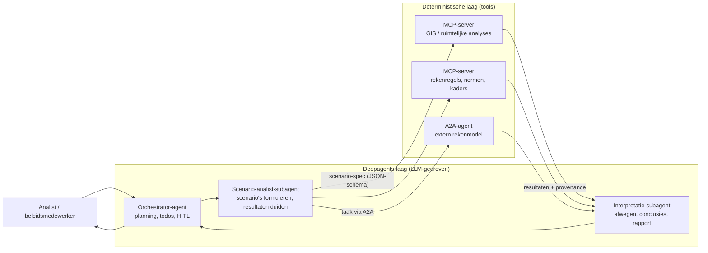
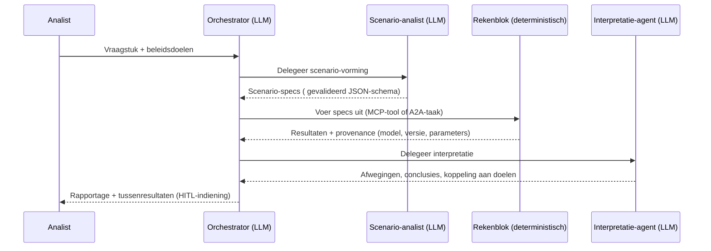
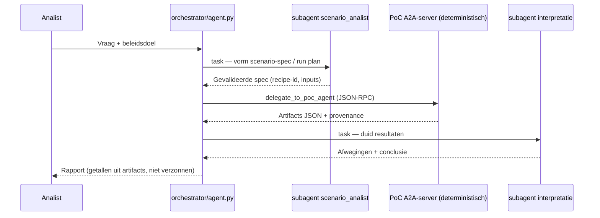

# Architectuur: LLM-gedreven deepagents met deterministische rekentools

Architectuurontwerp voor het doorrekenen van scenario's met LangChain **deepagents** en het **A2A-protocol**, met een strikte scheiding tussen LLM-gedreven agents (interpretatie, afweging, planning) en deterministische tools (rekenwerk, GIS, normtoetsing).

## 1. Ontwerpprincipe

> **LLM-agents zijn de interpretatie- en orkestratielaag; alle getallen die verdedigbaar moeten zijn, komen uit deterministische tools. Een LLM rekent nooit zelf door.**

Het hybride patroon per scenario-run is altijd:

**LLM specificeert → tool rekent → LLM interpreteert**

Dit patroon is uniform herbruikbaar voor alle scenario's en maakt elke uitkomst herleidbaar tot (a) een gevalideerde scenario-specificatie en (b) een gelogde rekenuitvoering.

## 2. Architectuuroverzicht



### Kern van de scheiding

| Laag | Bestaat uit | Verantwoordelijkheid |
|---|---|---|
| Deepagents-laag (LLM) | Orchestrator, scenario-analist, interpretatie-subagent | Plannen, delegeren, scenario's vormen, resultaten duiden, afwegingen benoemen |
| Deterministische laag | MCP-servers, A2A-agents, lokale tools | Herhaalbaar rekenwerk, GIS-analyses, norm- en regeltoetsing, externe modellen |

De LLM-agent produceert een **scenario-specificatie** (gestructureerde output, gevalideerd tegen een schema). De deterministische laag rekent en retourneert **resultaten mét provenance**. Pas daarna interpreteert de LLM weer. Ongeldige specificaties worden afgevangen door schema-validatie, niet door vertrouwen in de LLM.

## 3. Rollen en verantwoordelijkheden

| Rol | LLM-gebruik | Wat het wél doet | Wat het níet doet |
|---|---|---|---|
| Orchestrator | Hoog | Plant runs, delegeert naar subagents, human-in-the-loop interrupts | Zelf rekenen of getallen produceren |
| Scenario-analist | Hoog | Vertaalt beleidsdoelen naar scenario-specificaties (JSON) | Getallen verzinnen of benaderen |
| Reken-/GIS-tools | Geen | Deterministische berekeningen, met versie- en inputregistratie | Interpreteren of afwegen |
| Interpretatie-agent | Hoog | Weegt resultaten, benoemt afwegingen, koppelt uitkomsten aan beleidsdoelen | Nieuwe berekeningen verzinnen buiten de tools om |

## 4. Uitwerking in deepagents

```python
from deepagents import create_deep_agent

agent = create_deep_agent(
    model="anthropic:claude-sonnet-4-6",
    tools=[gis_overlay, bereken_functie_mix, toets_normen],  # MCP-tools of lokale Python-functies
    subagents={
        "scenario_analist": {
            # LLM-zwaar: scenario's vormen, resultaten duiden
            "description": "Formuleert scenario-specificaties en duidt rekenuitkomsten",
            "model": "anthropic:claude-sonnet-4-6",
            "tools": [],  # geen eigen rekenwerk; leverde specs aan de orchestrator-tools
        },
    },
)
```

Aandachtspunten:

- **Gestructureerde output als wapen.** Laat de scenario-analist een Pydantic-model retourneren dat 1-op-1 overeenkomt met de input van het rekenblok. Ongeldige specs zijn dan een valideringsfout in plaats van een hallucinatie die doorsijpelt naar de rekenuitkomst.
- **Context-isolatie via subagents.** Zware tool-output (GIS-lagen, lange tabellen) blijft in de subagent; de orchestrator krijgt alleen de samenvatting en de essentiële indicatoren.
- **Virtueel bestandssysteem.** Gebruik de ingebouwde filesystem-functionaliteit van deepagents om tussentijdse artefacten op te slaan: scenario-specs, ruwe rekenuitkomsten en interpretaties als bestanden met duidelijke naamgeving.
- **Human-in-the-loop.** Onderbreek de run bij beslispunten (keuze van scenario-varianten, goedkeuring van aannames) met de interrupt-mechanismen van deepagents.

## 5. Eén scenario-run als sequence



## 6. A2A versus MCP: wanneer wat

| Criterium | MCP | A2A |
|---|---|---|
| Scope | Tools binnen de eigen stack | Agents over systeem-, team- of organisatiegrenzen |
| Vertrouwensdomein | Eigen beheer | Externe partij met eigen levenscyclus |
| Passende usecase | GIS-functies, rekenmodules, regelgevingschecks | Rekenmodellen van andere afdeling of kennisinstelling |
| Rol van LLM in het rekenblok | Niet nodig | Ook niet nodig — een deterministisch rekenblok is een valide A2A-agent |
| Contract | Tool-schema | Agent Card |

Vuistregel: **MCP binnen je eigen vertrouwensdomein, A2A zodra het rekenende blok een ander systeem of organisatie is.** Via A2A vraag je het rekenblok aan als black box met een Agent Card als contract, geschikt voor langlopende taken over domeingrenzen.

## 7. Contracten en provenance

Twee afspraken maken de structuur verdedigbaar:

1. **Contract per koppeling.** Elke LLM-naar-tool-koppeling heeft een expliciet, gevalideerd schema (Pydantic / JSON Schema). De LLM kan alleen leveren wat het schema toestaat.
2. **Provenance per resultaat.** Elke retour van de deterministische laag bevat:
   - welke berekening/tool is uitgevoerd,
   - de model- of regelversie,
   - de gebruikte parameterset (of een verwijzing ernaar),
   - tijdstempel van uitvoering.

   Sla dit op als record in het virtuele bestandssysteem. Zo is elke conclusie herleidbaar tot een concrete rekenuitvoering — het verschil tussen een verdedigbaar afwegingskader en een onnavolgbare "de AI zei het"-uitspraak.

## 8. Vuistregels voor de verdeling LLM versus deterministisch

| Kenmerk | Thuis in |
|---|---|
| Herleidbaar, herhaalbaar, normatief, juridisch toetsbaar | Deterministische tool |
| Afwegen, interpreteren, formuleren, prioriteren, koppelen aan beleidsdoelen | LLM-agent |
| Getallen in een rapport | Altijd uit een tool, nooit uit een LLM |
| Keuze van scenario-varianten en aannames | LLM stelt voor, mens keurt goed (HITL) |

## 9. Stappenplan voor opzet

1. Definieer het Pydantic-schema van de scenario-specificatie en van het resultatenrecord (inclusief provenance-velden).
2. Bouw de eerste deterministische tool als MCP-server (één rekenmodule of GIS-analyse).
3. Zet de orchestrator op met `create_deep_agent`, met de scenario-analist en interpretatie-agent als subagents.
4. Voeg schema-validatie toe op de uitvoer van de scenario-analist.
5. Voeg HITL-interrupts toe op de beslispunten.
6. Koppel het eerste externe rekenblok via A2A en registreer de Agent Card.
7. Sla per run specs, resultaten en interpretaties op in het virtuele bestandssysteem.

## 10. Implementatie in `a2a-simulation/`

Deze map is het **referentie-skelet** uit §9, gekoppeld aan de nLDT PoC’s en de EU LDT Toolbox.

### 10.1 Laagmapping

| Architectuur (§2–3) | Code / proces | Transport |
|---------------------|---------------|-----------|
| Orchestrator (LLM) | [`orchestrator/agent.py`](orchestrator/agent.py) + prompt [`orchestrator/prompts/orchestrator.md`](orchestrator/prompts/orchestrator.md) | — |
| Scenario-analist (LLM) | Subagent `scenario_analist` → [`prompts/scenario_analist.md`](orchestrator/prompts/scenario_analist.md); tools `list_recipes` / `get_recipe` (schema, geen rekenwerk) | in-process `task` |
| Interpretatie-agent (LLM) | Subagent `interpretatie` → [`prompts/interpretatie.md`](orchestrator/prompts/interpretatie.md) | in-process `task` |
| Rekenblok (deterministisch) | PoC-mesh [`agents/server.py`](agents/server.py) per PoC; **geen LLM** in `A2A_SIM_MODE=simulate` of `nldt` | **A2A 1.x** JSON-RPC |
| Rekenblok (eigen stack) | nLDT MCP + process adapter (`nldt/services/mcp_servers`, `:8093`) | **MCP** |
| Federatie-client / test | [`federator/client.py`](federator/client.py) | A2A client |

**Ontwerpregel in code:** PoC-A2A-servers (`9181–9186`) zijn **deterministische rekenblokken** (fixtures of nLDT-orchestrator). LLM-draai staat alleen in `orchestrator/`.

### 10.2 Scenario-run (sequence → repo)



### 10.3 Modi van het rekenblok (A2A-server)

| `A2A_SIM_MODE` | Gedrag | Laag |
|----------------|--------|------|
| `simulate` | Fixtures [`fixtures/tasks/`](fixtures/tasks/) met provenance-velden | Deterministisch (demo) |
| `nldt` | Proxy naar nLDT legacy orchestrator `:8085` (LangGraph + process adapter) | Deterministisch (governed recipes) |

Start nLDT altijd met [`scripts/start_nldt_stack.sh`](scripts/start_nldt_stack.sh) — **`PYTHONPATH` alleen `nldt/`**, anders faalt `agents.orchestrator` op `:8085`.

Auth: Agent Card `euLdtToolboxBearer`; mesh `A2A_SIM_AUTH=static` + `NLDT_STATIC_TOKENS`.

### 10.4 PoC-catalogus

[`catalog/poc-agents.json`](catalog/poc-agents.json) — één **Agent Card** per governed PoC (Breda, Utrecht, Rijnland, Eindhoven, Crosstrack, MiniGIM); AgentSkill = recipe-id.

### 10.5 Start

```bash
./scripts/run_mesh.sh          # deterministische PoC-mesh
python -m federator.client send rijnland "…"   # alleen rekenblok
../deep-agents/.venv/bin/python -m orchestrator.agent "…"  # volledige LLM→A2A→LLM-run
```

Zie [`README.md`](README.md) voor omgevingsvariabelen en links naar [A2A 1.0](https://a2a-protocol.org/latest/specification/) en [`deep-agents/`](../deep-agents/).