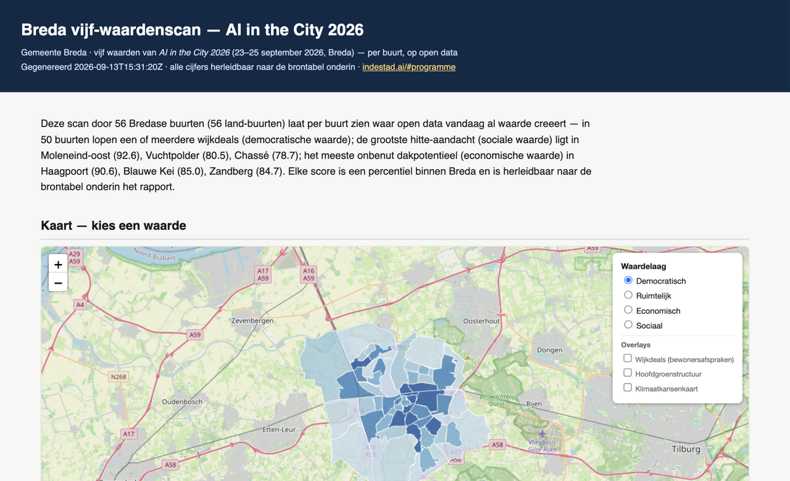
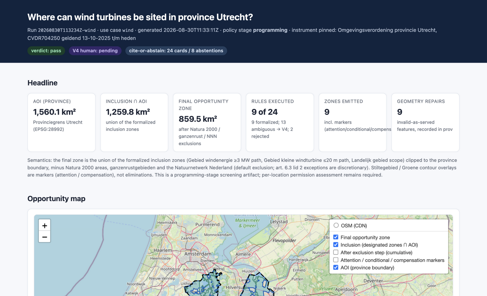
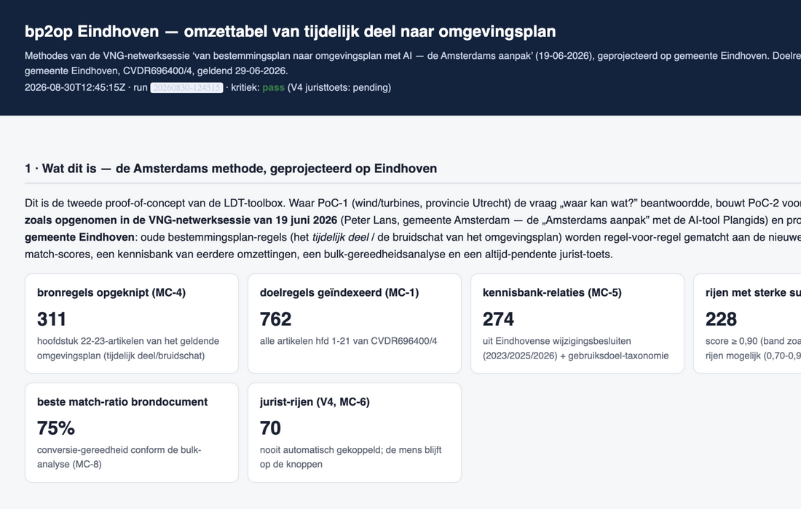
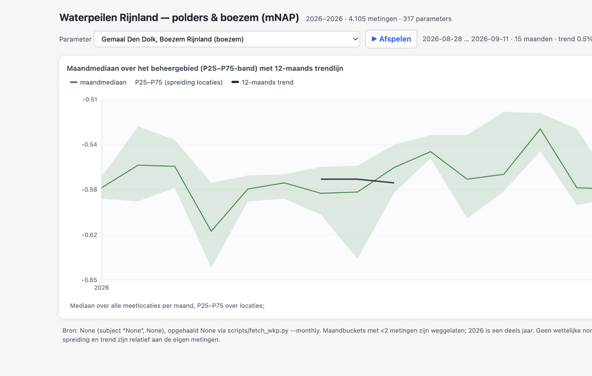

<!-- Render: npx @marp-team/marp-cli <this file> -o slides.html --allow-local-files
     (the flag is REQUIRED for the screenshots in assets/ — without it the
     export silently paints empty backgrounds). PDF/PPTX likewise. -->

<style>
@import url('https://fonts.googleapis.com/css2?family=Archivo:wght@500;700;800&family=JetBrains+Mono:wght@400;600&display=swap');

:root {
  --navy: #060644; --navy-dark: #040433;
  --teal: #099f80; --cyan: #00b8d4; --amber: #e8a838;
  --violet: #8a2be2; --green: #2e8b57; --blue: #1d6fa4;
  --signal: #f5854d; --ink: #111827; --muted: #6b7280;
  --line: rgba(6, 6, 68, 0.15); --paper: #f4f6f8;
}
section {
  font-family: 'Archivo', 'Inter', -apple-system, sans-serif;
  color: var(--ink); background: #fff;
  font-size: 23px; line-height: 1.42; padding: 56px 66px 66px;
  border-top: 6px solid var(--cyan);
  justify-content: start;
}
section h1 { font-size: 1.55em; font-weight: 800; color: var(--navy); line-height: 1.12; }
section h2 { font-size: 1.12em; font-weight: 700; color: var(--navy); margin: 0 0 0.45em; }
section h3 { font-size: 0.92em; font-weight: 700; color: var(--teal); margin: 0.7em 0 0.2em; }
section.lead, section.lead h1, section.lead h2 { color: #fff; background: var(--navy); border-top: none; }
section.lead h1 { font-size: 1.75em; }
section.lead::after { content: ''; }
section strong { color: var(--navy); }
section.lead strong { color: #fff; }
section em { color: var(--teal); font-style: italic; }
section a { color: var(--teal); }
code, pre { font-family: 'JetBrains Mono', 'SF Mono', monospace; }
pre { font-size: 0.62em; line-height: 1.4; background: var(--paper);
      border: 1px solid var(--line); border-radius: 6px; padding: 10px 14px; }
code { background: var(--paper); border: 1px solid var(--line); border-radius: 4px;
       font-size: 0.82em; padding: 0 4px; }
blockquote { border-left: 4px solid var(--signal); background: var(--paper);
             margin: 0.5em 0; padding: 8px 16px; color: var(--navy); font-size: 0.95em; }
table { font-size: 0.78em; border-collapse: collapse; width: 100%; }
th { border-bottom: 2px solid var(--navy); color: var(--navy); text-align: left; padding: 4px 8px; }
td { border-bottom: 1px solid var(--line); padding: 4px 8px; vertical-align: top; }
ul { padding-left: 1.1em; } li { margin: 0.22em 0; }
footer { color: var(--muted); font-family: 'JetBrains Mono', monospace; font-size: 15px; }
section::after { color: var(--muted); font-family: 'JetBrains Mono', monospace; font-size: 16px; }
section.lead::after, section.lead footer { color: rgba(255,255,255,0.55); }
.tag { font-family: 'JetBrains Mono', monospace; font-size: 0.55em; letter-spacing: 0.08em;
       text-transform: uppercase; color: var(--cyan); }
.track-democratic { border-top-color: var(--cyan); }
.track-spatial { border-top-color: var(--green); }
.track-economic { border-top-color: var(--amber); }
.track-social { border-top-color: var(--signal); }
.track-autonomous { border-top-color: var(--violet); }
.track-neutral { border-top-color: var(--navy); }
section.compact { font-size: 21px; }
</style>

<!-- _class: lead -->

<span class="tag">LDT Toolbox · Proof of Concept 1–4</span>

# Agentic AI in Spatial Planning

## Where it earns its keep — and where it must never decide

**Considerations from four proofs-of-concept, starting in Breda**

AI in the City 2026 — *Creating Real Value*
23–25 September 2026 · Breda · indestad.ai

---

<!-- _class: track-neutral -->

## Why this session

The five congress values are our test grid — every agentic pattern must serve one:

| Value | Congress promise |
|---|---|
| <span style="color:var(--cyan)">**Democratic**</span> | *"more accessible, faster and more human"* |
| <span style="color:var(--green)">**Spatial**</span> | *"A city is more than a dataset… amplifies the genius loci"* |
| <span style="color:var(--amber)">**Economic**</span> | *"lower costs, less waste and more output"* |
| <span style="color:var(--signal)">**Social**</span> | *"AI always serves human wellbeing"* |
| <span style="color:var(--violet)">**Autonomous**</span> | *"People retain control over AI systems"* |

**This deck:** where agentic AI enters spatial planning — **scenario planning**
and **question answering**, across all four PoCs — and what must stay
deterministic to make the five promises *demonstrable, not claimed*.

---

<!-- _class: lead -->

<span class="tag">The Core Consideration</span>

# LLMs propose.

# Deterministic engines

# dispose.

*(and humans hold the last button — always)*

---

<!-- _class: track-neutral -->

## Two agentic patterns, one anatomy

*A **seam** = a strictly controlled gateway where the model may hand in
proposals on a fixed form — like a counter form: fill it in properly, or
it goes back.*

```
        ┌─ SCENARIO-PLANNING SEAM (S7/S8) ─────────────────────────┐
agent ─▶│ proposes what-if variants as a CONTRACT (ScenarioSpec)   │
        │ basis: norm_variance · policy_variant · hypothetical     │
        └──────┬───────────────────────────────────────────────────┘
               ▼  deterministic gate: schema + id-grounding + ledger
        ┌─ Q&A SEAM (S3/S4) ──────────────────────────────────────┐
agent ─▶│ turns a natural-language question into a QUERY contract │
        │ narrates the deterministic answer under a number-gate  │
        └──────┬───────────────────────────────────────────────────┘
               ▼  deterministic runner reads ONLY the canonical artifact
```

In both patterns the agent **never touches the data, the scores, or the verdict**.
What fails the gate lands in a public rejection ledger — never silently repaired.

---

<!-- _class: track-autonomous -->

## The trust mechanisms (identical in every PoC)

1. **Cite-or-abstain** — no claim without a verifiable source; abstention is
   recorded, guessing is not an option (legal quotes · CBS sentinels · unmappable questions)
2. **Schemas at every boundary** — every artifact leaving a stage is
   machine-validated; model shape-drift is caught *before* execution
3. **Validation V0–V4** — syntax → geometry → grounding → independent
   re-execution → **human sign-off, pending by design**
4. **PROV provenance** — sha256 per artifact, model+prompt per proposal,
   source + timestamp per number; identity is stamped by the *seam*,
   never self-claimed by the model

---

<!-- _class: lead -->

<span class="tag">PoC-4 · Gemeente Breda — starting here</span>

# The five-value scan

# *the congress grid, mapped per neighbourhood*

56 neighbourhoods · 11 districts · CBS 2024 + the city's own open data
(data.breda.nl · geo.breda.nl) · zero API keys · fully re-runnable

---

<!-- _class: track-democratic -->

## PoC-4 Breda: what the scan is

> Where does open data create value *today* — per neighbourhood,
> for each of the five congress values, every number traceable?

- Four percentile scores per neighbourhood + a **sovereignty manifest**
  as the fifth value (provable, not claimable: no keys, no vendor lock,
  no LLM in the decision line)
- The trade-off the twin exposes: **Belcrum** — highest democratic score
  (96.3), lowest spatial score (19.5)
- Canonical run: verdict **pass**, 0 degradations, replays offline from disk

| Value | Indicator | Congress session answered |
|---|---|---|
| Democratic | service distance + wijkdeals (50/56) | *Residents in the driving seat* |
| Spatial | green backbone + climate-opportunity map | *Green Spaces & Water as the backbone* |
| Economic | unused roof potential + business density | *AI Walk: Energy savings* (TNO) |
| Social | heat attention: paved share × 65+ | climate adaptation |

---

<!-- _class: track-democratic -->



## The artifact — live report

**Single-file HTML, opens from disk**

- democratic layer active, 56 neighbourhoods
- overlays: wijkdeals · green backbone · climate opportunities
- every number clicks through to its source table
- verdict **pass** — replays offline from cache

*the congress grid, made walkable per neighbourhood*

---

<!-- _class: track-democratic -->

## Q&A seam in PoC-4 — a live walk-through

> **"Why does Belcrum score low on spatial value?"** *(asked & answered in Dutch)*

```
vraag (NL) → asker (parser | LLM) → ScanQuery (schema contract)
          → deterministic runner → value-scan.json only
          → answer | LLM narration behind the number-gate
```

The grounded answer cites what the artifact holds:

- spatial score **19.5** vs city median **52.1** · green coverage **5.7%**
  · **930** trees · **21.91** trees/100 residents
- *missing, stated openly:* distance-to-public-green (CBS withheld it)
- climate opportunities quoted verbatim from the city's own map

**Three live paths with local qwen3.8:** shape drift → ledger ·
honest abstention respected · grounded narration **accepted**

---

<!-- _class: track-autonomous -->

## The gate lesson from PoC-4 (worth a slide of its own)

First live narration was **rejected — three violations**.
Investigation: the model had copied every number correctly.
**The gate itself was wrong:**

- float precision truncated in our own number collection (`:g` formatting)
- dict *keys* (`bomen_per_100_inw`) not counted as grounding for
  "per 100 residents"
- Dutch thousands separators ("4.245" = 4,245) flagged as fabrication

> **A grounding gate must first prove itself.**
> Strictness without calibration punishes honest phrasing —
> and teaches you about your own instrument, not about the model.

Every fix became a unit test — **73 offline tests** for this PoC alone.

---

<!-- _class: track-spatial -->

## Scenario planning in PoC-4 — designed next, contract first

The pattern PoC-1 proved (next section), transplanted to *value politics*.
The agent may vary **weights, thresholds and joins** — declared per variant:

| Example proposal | Basis class | What it would show |
|---|---|---|
| heat attention ×2 where 65+ share > 25% | `policy_variant` | where adaptation leverage concentrates |
| green coverage counts double in spatial | `hypothetical` | no evidential basis — rationale *required* |
| access score needs 6/6 services (not 4/6) | `indicator_variance` | which neighbourhoods lose democratic score |
| wijkdeals coverage as a hard democratic floor | `policy_variant` | rural vs urban service equity |

Same guarantees: proposals are schema-validated contracts · the sweep
re-executes **offline from cache** with a control that must reproduce the
baseline · every mutated parameter is declared, nothing hidden in a prompt.

---

<!-- _class: lead -->

<span class="tag">PoC-1 · Province of Utrecht</span>

# "Where can what?"

# wind · solar · forest — and the most mature
# agentic seam in the toolbox

---

<!-- _class: track-spatial -->

## PoC-1: the deterministic foundation

- Question: *in which zones could the provincial regulation allow wind
  turbines ≥3 MW, solar fields, new forest — every norm **cited**
  (instrument · article · version · verbatim quote · URL)?*
- 24 norm cards per track, zone engine executes them; 13 deliberately
  *ambiguous* open norms → human review (V4), never guessed
- The **decision table** is the grounding substrate for Q&A:
  every row links a rule, its citation and its zone effect

**Why scenario planning lives here:** discretionary clauses and buffer
parameters are the *levers* of spatial policy — exactly the things a
policy maker deliberates. The agent proposes which levers to pull;
**the engine computes the consequence, the critic the truth about it.**

---

<!-- _class: track-spatial -->



## The artifact — Utrecht wind

**Where can turbines ≥3 MW stand?**

- final opportunity zone: **859.5 km²** after cited exclusions
- layer switcher: inclusions, per-exclusion cumulative zones,
  attention / conditional / compensation markers
- every marker links to an article — verbatim quote + URL

*zone truth is polygon-based; H3 is only a reporting layer*

---

<!-- _class: track-spatial -->

## The scenario seam, implemented (Phase A+B+B2)

- A scenario is a **contract, not a prompt**: `ScenarioSpec` with mutations
  (`drop` · `set_semantics` · `set_buffer_distance_m`) and a mandatory
  **basis declaration** — `norm_variance` (varies a cited rule's parameter) ·
  `policy_variant` (flips a documented discretionary choice) ·
  `hypothetical` (free exploration, rationale required, no legal grounding claimed)
- Three authors behind one interface: `file` · `auto` (deterministic) ·
  `--author llm` (proposals only)
- Gates: schema · id-grounding against the baseline run (hallucinated rule
  ids are *authoring failures*, ledgered) · control must reproduce the
  baseline (≤0.1% rel) before any variant counts

**Canonical LLM run (qwen3.8):** 10/10 proposals accepted — every id real;
the deterministic author doubles as the golden-set regression in CI.

---

<!-- _class: track-spatial -->

## PoC-1 scenario examples — real numbers from the sweep

| Variant (basis) | Effect on opportunity zone |
|---|---|
| NNN lid-2 exception province-wide (`policy_variant`) | **+322.5 km² (+37.5%)** wind |
| Silence area as hard exclusion (`policy_variant`) | −143.2 km² (−16.7%) |
| Attention buffer 500 / 1500 / 3000 m (`norm_variance`) | −215.0 / −334.0 / −525.8 km² |
| 500 m Natura 2000 setback (`hypothetical`) | −46.9 km² (−5.5%) |
| Solar: Natura carve at face value (`hypothetical`) | **+0.011 km² — symbolic** |
| Forest search-area +1 km band (`hypothetical`) | 395.4 km² — **16.5×** |

The `hypothetical` class is the honest counterpart of the abstention
ledger: a varied buffer has **no citation — and says so**.

---

<!-- _class: track-spatial -->

## What the sweep surfaced that nobody asked for

The deterministic author (`--author auto`) found non-obvious facts:

- a hypothetical 500 m NNN buffer costs **−52.2%** of the wind zone
- hard-enforcing the NNN *conditional* overlay changes **nothing**
  (Δ +0.000, IoU 1.0) — it is fully subsumed by the default exclusion

Golden-set comparison (solar track): deterministic author 3 proposals on
2 rules vs LLM 10/10 on 3 rules — both target the same core rules;
**both authors' mutations execute to identical geometries.**
*The engine, not the author, decides.*

---

<!-- _class: track-autonomous -->

## The narration gate — four hard-won rules (S8)

The narrator writes prose over the report; every number must resolve
against it. Observed rejections — each now a rule:

1. **Hallucinated id** — narration cited `SC-08-INCLUSION-BUFFER-1000`;
   the report says `-100` → ids must resolve, verbatim
2. **Sign-folded magnitudes** — "decrease of 64.67 km²" for reported
   `-64.67` is grounded phrasing → the gate folds signs, not facts
3. **Verdict assertion** — prose may use pass/fail words only in agreement
   with the report's own verdict field
4. **Don't lie to the seam** — the first narrations quoted a *placeholder*
   verdict the report still carried before the critic ran; the model was
   faithfully narrating what it was shown. Narrate only after the final
   verdict exists.

Result: the canonical run's Dutch narration passed every gate and is
published — the rejection path tested, not just designed.

---

<!-- _class: track-democratic -->

## Q&A seam in PoC-1 — designed (S4), substrate ready

Planned pattern, identical to PoC-4's: natural-language questions over the
**decision table + norm cards**, cite-or-abstain.

> *"Why is this parcel excluded from the wind zone?"*

Grounded answer shape (what the runner would emit):

- parcel falls in `Natura 2000` + ` ganzenrustgebied` → hard exclusion
  per the art.-5.4 toelichting (verbatim quote, CVDR704250, geldend 13-10-2025)
- also inside 1500 m `Aandachtsgebied stiltegebied` (art. 9.25 lid 2) —
  an *attention* marker: **never** removes area, routes to review
- decision-table row + norm-card ids cited; anything unproven → abstain

This is the democratic value made operational: *every exclusion arrives
with its legal reason attached.*

---

<!-- _class: lead -->

<span class="tag">PoC-2 · Gemeente Eindhoven</span>

# From zoning plan to environment plan

# knowledge work: acceleration with the
# lawyer on the buttons

---

<!-- _class: track-economic -->



## The artifact — Eindhoven

**Method-traceable conversion report**

- every pipeline feature cites its method card (MC-1…MC-12),
  distilled from the archived VNG session
- the **omzettabel**: 311 rows old-law rule → new *doelregeling*,
  with match scores — suggestions are **never auto-applied**
- knowledge bank of earlier "replaces" relations (MC-5)

*acceleration you can audit, paragraph by paragraph*

---

<!-- _class: track-economic -->

## PoC-2: agentic AI in plan conversion

Built from the recorded VNG method of the Amsterdam approach (Plangids),
method cards MC-1…MC-12 distilled from the archived session transcript.

- **S5 — matching re-ranker**: LLM re-ranks text-driven matches between
  old-law rules and the new *doelregeling*. Gate: the independent Jaccard
  re-scorer keeps measuring disagreement — *swap the judge, measure the delta*
- **S6 — drafting**: candidate *doelregels* for `gebruik:overig` clusters,
  status always `voorgesteld` with a per-row review trail
- **Hard rule (MC-6):** nothing is ever `gekoppeld` by AI — the lawyer decides

- **The numbers it works with:** knowledge bank of 262 + 12 + 9 "replaces"
  relations from official publications; portfolio of 370 plans
  (338 adopted, 18 in conversion)

→ **Economic value**: hours out of repetitive legal knowledge work —
without transferring legal discretion to a model.

---

<!-- _class: lead -->

<span class="tag">PoC-3 · Hoogheemraadschap van Rijnland</span>

# Water, levels and quality

# deliberately *without* an agent — for now

---

<!-- _class: track-social -->



## The artifact — Rijnland water levels

**Growing measurement archive (mNAP)**

- 315 stations — 131 polder, 184 boezem
- 4,079 station-days snapshotted from public sources
- station series + median aggregates, min–max band
- deviations vs. the established level order — deterministic,
  offline-replayable

*the canonical artifact an agent would later answer over*

---

<!-- _class: track-social -->

## PoC-3: deterministic first — then invite the agent

- Level management vs. the established level order (315 stations,
  131 polder + 184 boezem, 4,079 station-days), KRW monitoring coverage,
  measured quality (11 substances), 2020–2026 time series, H3 hex maps
  with Moran's I — all deterministic, offline-replayable
- **±1.44 M measurement rows** aggregated to 792 monthly buckets —
  the canonical artifact comes first

**Where the seams would land (designed, honest status: not implemented):**

| Seam | Example it must answer |
|---|---|
| Q&A | *"which polders deviate most from the level order?"* — grounded on the peil-conflict artifact, per-cell H3 evidence cited |
| Scenario | level-target variant per polder (`norm_variance` on the peilbesluit) → capacity-weighted drainage effect, control first |

> Agentic AI is only responsible **on top of** a deterministic base.
> Without a reproducible foundation every agent answer is an act of
> faith; with one, it becomes an auditable argument.

---

<!-- _class: track-neutral -->

## The seam matrix — pattern × PoC

| | **Scenario planning** | **Q&A / narration** |
|---|---|---|
| **PoC-4 Breda** | designed: value-politics variants (weights/thresholds) | **live-validated** (qwen3.8): 3 paths demonstrated |
| **PoC-1 Utrecht** | **implemented** — file/auto/llm authors, 10/10 accepted, sweep numbers | narration **implemented** + gated; run-directory Q&A designed |
| **PoC-2 Eindhoven** | conversion-strategy variants (bulk vs area-by-area) — candidate | matching re-rank (S5) designed as swap-the-judge; drafts S6 always `proposed` |
| **PoC-3 Rijnland** | designed: level-target norm-variance sweep | designed: grounded deviation Q&A |

Reading: the agent surface grows **only after** the deterministic
substrate and its gates exist — never before.

---

<!-- _class: track-neutral -->

## The considerations, on one slide

| # | Consideration | Demonstrated by |
|---|---|---|
| 1 | Proposing ≠ deciding — seams everywhere | Q&A gate · ScenarioSpec · MC-6 |
| 2 | Cite-or-abstain over guessing | CBS sentinels · 13 ambiguous norms · unmappable questions |
| 3 | Schemas for agent output too | `'Belcrum'` in `focus` → ledger |
| 4 | Identity stamped by the seam, not the model | `llm-proposal#qwen3.8` in PROV |
| 5 | Humans hold the last button (V4) | lawyer (MC-6), official, congress |
| 6 | Local, open models only | Ollama-served qwen3.8 — no vendor |
| 7 | Provenance per number | sha256, lastChecked, prompt hash |
| 8 | Gate quality is its own work item | the PoC-4 gate-bug lesson |

---

<!-- _class: track-neutral -->

## What agentic AI yields per value — and what to watch

| Value | Gain | Watch |
|---|---|---|
| Democratic | plain-language questions, answers with sources | answer-gate; no advice role |
| Spatial | policy levers explored systematically | proposals ≠ decisions |
| Economic | hours out of repetitive legal work | the lawyer still signs |
| Social | adaptation priorities data-driven | determinism before agents |
| Autonomous | local models, open data, re-runnable | manifests re-proven every run |

**None of the five values is a sum.** The per-neighbourhood profile is
the product — never a single city grade.

---

<!-- _class: track-spatial compact -->

## Next 1 — the scenario seam for the five-value scan

*Port the pattern PoC-1 proved to value politics — mostly copy-work.*

- **Exists:** `scenario_author.py` — file/auto/llm behind one interface ·
  rejection ledger · control-reproduction gate · offline sweep from cache
- **To build:** mutations over indicator *inputs*, not rule semantics —

| Example (basis) | Mutation |
|---|---|
| `indicator_variance` | access score requires 6/6 services (now 4/6) |
| `policy_variant` | heat attention ×2 where 65+ share > 25% |
| `policy_variant` | wijkdeals coverage as a hard democratic floor |
| `hypothetical` | green coverage double in spatial — rationale required |

- Gates unchanged: schema · buurtcode grounding vs the scan · control must
  reproduce the canonical scores **exactly** (deterministic recompute —
  bit-identical, stricter than PoC-1's ≤0.1%)
- Deliverable: per-variant Δscores + **rank-stability** — which buurten
  stay top/bottom whatever the weighting

---

<!-- _class: track-autonomous compact -->

## Next 2 — a source-monitor agent

Answers *Data sovereignty and -continuity* — continuity is a monitored
process, not a snapshot. Substrate already ships: `sources.json` +
`layers.json` (lastChecked, featureCount) per run.

- **Deterministic probe (scheduled):** service metadata (`maxRecordCount`,
  fields, layer list) · feature counts vs registry · sample attributes ·
  WFS capabilities → machine diff registry-vs-live
- **Agent role (proposal only):** draft the human-readable change report +
  registry patch — every number must cite probe output (the Q&A number-gate,
  reused); **never auto-applied**, a human merges (V4)

Hard-won monitor checklist, from this build: per-service page caps
(Bomen=1000 vs Wijkdeals=2000) · CBS ignores `cql_filter` — the OGC XML
filter works · a new CBS year can change the buurt set itself ·
license/endpoint drift

> Catches the failure we actually hit: 117,012 trees quietly
> becoming 1,000 in a run's source table.

---

<!-- _class: track-neutral -->

## Next 3 — nldt/MCP orchestration of the agent layer

One governed agent layer over all PoCs, instead of per-PoC seams.
The pieces exist (`nldt/05-agentic-ai-layer.md`):

- **Roster:** Orchestrator (LangGraph, checkpointed) · Catalog Navigator ·
  Recipe Planner · Process Executor · **Critic** · Explainer
- **MCP servers:** `nldt-catalog-mcp` (search_records, get_record,
  list_processes) · `nldt-process-mcp` (describe/execute/get_job_status)
- **To build:** register the scan pipelines as catalog processes/recipes —
  the five-value scan becomes callable like
  `spatial-overlay-analysis` today; the PoC seams (Q&A, scenario author)
  become tools the planner may compose

Same doctrine, one level up: S1 ranking · S2 NL→AgentPlan (schema gate) ·
S3 narration (cite job keys only) — LLM plans and explains, **the critic
and the process engines stay deterministic**; checkpoints give audit trails
per step.

---

<!-- _class: lead -->

<span class="tag">Closing</span>

# Real value is **verifiable** value

every number traceable to a source · every agent proposal gated
— or publicly rejected · every run replayable from disk

# The question is not *whether* AI becomes
# a layer in the city —

# **it is who holds the buttons.**

*Build orders: the scenario seam · the source monitor · nldt/MCP orchestration*

---

<!-- _class: track-neutral -->

## Colophon & traceability

- LDT toolbox: `poc/` (Utrecht) · `poc-bp2op/` (Eindhoven) ·
  `poc-rijnland/` · `poc-breda/` — every run re-runnable, offline from cache
- Doctrine in plain language (incl. technical annex):
  `docs/GENAI_SEAMS.md` · agent layer: `nldt/05-agentic-ai-layer.md`
- Breda scan: `poc-breda/runs/20260913T152919Z-breda-scan/report.html`
  (56 neighbourhoods, verdict pass) · live Q&A: `poc-breda/qa_run.py --demo`
- Congress programme quotes: indestad.ai/en/#programme (consulted 13-9-2026)
- **323 offline tests** across the four PoCs (185 + 32 + 33 + 73);
  zero API keys; local models (qwen3.8 via Ollama)

*Style after the AI in the City 2026 design language — navy #060644,
track colours, Archivo & JetBrains Mono.*
