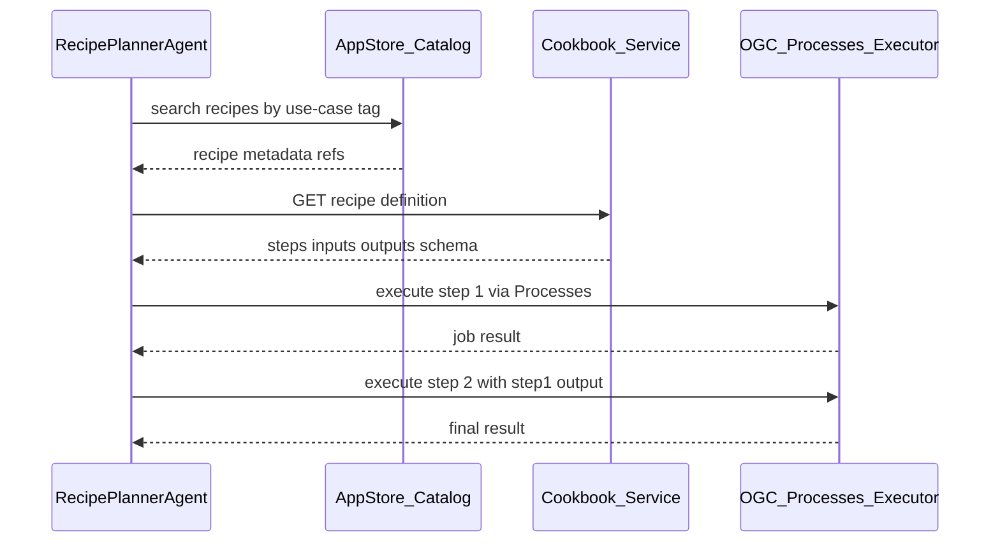

# 04 — Recipes en processen

## AppStore → Cookbook → Cook

Conform [nLDT Testbed 2026 phase 2](../nldt-testbed2026-phase2-invitation-to-tender.pdf):

| Rol | Functie | Implementatie |
|-----|---------|---------------|
| **AppStore** | Catalogus; metadata + link naar recipe | `catalog_adapter` (OGC API Records) |
| **Cookbook** | Recipe-definitie (steps, inputs, outputs) | `services/cookbook` |
| **Cook** | Uitvoering van process steps | `process_adapter` (OGC API Processes) |



## OGC API Processes

### Endpoints (process adapter)

| Method | Path | Beschrijving |
|--------|------|--------------|
| GET | `/` | Landing page (JSON) |
| GET | `/processes` | Process list |
| GET | `/processes/{processId}` | Process description |
| POST | `/processes/{processId}/execution` | Sync/async execution |
| GET | `/jobs/{jobId}` | Job status |
| GET | `/jobs/{jobId}/results` | Job outputs |

### Referentie-processen

| processId | Beschrijving |
|-----------|--------------|
| `fetch-features` | GeoJSON ophalen van URL of inline |
| `spatial-intersection` | Intersect twee FeatureCollections |
| `compute-area-statistics` | Oppervlakte (m²) per feature + totaal |
| `h3-polygon-to-cells` | Polygoon → H3-cellen met planaire EPSG:28992 dekkingsfracties (optioneel `restrictCells` / `compact`) |
| `h3-cells-to-geojson` | H3-celgrenzen als GeoJSON FeatureCollection |
| `h3-spatial-join-points` | Punten (of footprint-centroïden) indexeren in cellen; aantallen per cel |
| `h3-knn` | K nearest neighbours via H3-gridafstand met haversine tie-break |
| `h3-morans-i` | Ruimtelijke autocorrelatie (Moran's I) over `grid_disk`-buurten met permutatie-p-waarde |

## Recipe schema

Zie [`schemas/recipe.schema.json`](schemas/recipe.schema.json). Belangrijke velden:

- `steps[]` — ordered process invocations met template inputs (`${recipe.inputs.aoi}`)
- `requiredProcesses[]` — preflight check in catalog
- `riskLevel` — triggert HITL bij `high` of validation fail

## Referentie-recipe: Spatial Overlay Analysis

Bestand: [`recipes/spatial-overlay-analysis.json`](recipes/spatial-overlay-analysis.json)

1. **fetch-layer-a** — `fetch-features` met `layerAUri`
2. **fetch-layer-b** — `fetch-features` met `layerBUri`
3. **intersect** — `spatial-intersection` met outputs van stap 1+2
4. **stats** — `compute-area-statistics` op intersect resultaat

## Referentie-recipe: Hex Overlay Analysis (H3)

Bestand: [`recipes/hex-overlay-analysis.json`](recipes/hex-overlay-analysis.json)

1. **fetch-zone** / **fetch-points** — `fetch-features` met `zoneUri` / `pointsUri`
2. **cells** — `h3-polygon-to-cells` op de zone-polygoon
3. **join** — `h3-spatial-join-points` van de punten in de cellen
4. **autocorrelation** — `h3-morans-i` op de join-per-cel waarden

## Template resolution

Step inputs ondersteunen:

- `${recipe.inputs.<name>}` — recipe-level input
- `${steps.<stepId>.outputs.<name>}` — output van eerdere step

De recipe runner (`services/cli.py`) lost templates op vóór process execution.

## Catalog record voor recipe

Records entry (AppStore) bevat minimaal:

```json
{
  "id": "recipe-spatial-overlay-analysis",
  "type": "recipe",
  "title": "Spatial Overlay Analysis",
  "links": [
    { "rel": "self", "href": "http://localhost:8083/records/recipe-spatial-overlay-analysis" },
    { "rel": "recipe", "href": "http://localhost:8081/recipes/spatial-overlay-analysis", "type": "application/json" }
  ]
}
```

## CLI zonder agent

```bash
python -m services.cli run-recipe spatial-overlay-analysis \
  --input aoi='{"type":"Polygon","coordinates":[...]}' \
  --input layerAUri=https://example.com/a.geojson \
  --input layerBUri=https://example.com/b.geojson
```
