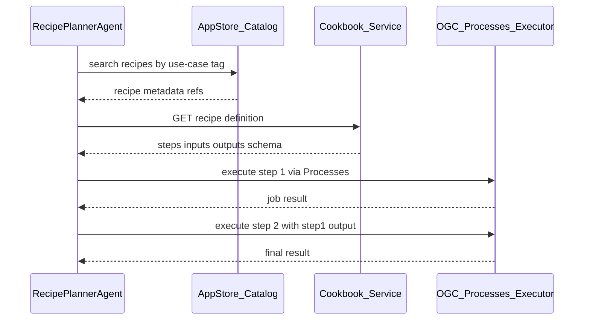

# 04 — Recipes and processes

## AppStore → Cookbook → Cook

Per [nLDT Testbed 2026 phase 2](../nldt-testbed2026-phase2-invitation-to-tender.pdf):

| Role | Function | Implementation |
|------|----------|----------------|
| **AppStore** | Catalog; metadata + link to recipe | `catalog_adapter` (OGC API Records) |
| **Cookbook** | Recipe definition (steps, inputs, outputs) | `services/cookbook` |
| **Cook** | Execution of process steps | `process_adapter` (OGC API Processes) |



## OGC API Processes

### Endpoints (process adapter)

| Method | Path | Description |
|--------|------|-------------|
| GET | `/` | Landing page (JSON) |
| GET | `/processes` | Process list |
| GET | `/processes/{processId}` | Process description |
| POST | `/processes/{processId}/execution` | Sync/async execution |
| GET | `/jobs/{jobId}` | Job status |
| GET | `/jobs/{jobId}/results` | Job outputs |

### Reference processes

| processId | Description |
|-----------|-------------|
| `fetch-features` | Fetch GeoJSON from URL or inline |
| `spatial-intersection` | Intersect two FeatureCollections |
| `compute-area-statistics` | Area (m²) per feature + total |
| `h3-polygon-to-cells` | Polygon → H3 cells with planar EPSG:28992 coverage fractions (optional `restrictCells` / `compact`) |
| `h3-cells-to-geojson` | H3 cell boundaries as GeoJSON FeatureCollection |
| `h3-spatial-join-points` | Index points (or footprint centroids) into cells; counts per cell |
| `h3-knn` | K nearest neighbours via H3 grid distance with haversine tie-break |
| `h3-morans-i` | Spatial autocorrelation (Moran's I) over `grid_disk` neighbourhoods with permutation p-value |
| `h3-grid-disk` | `grid_disk` neighbours per cell (origin + cells within k steps) — e.g. display stitching and proximity rings |

### PoC and lake processes (Phase 5/6)

| processId | Description |
|-----------|-------------|
| `breda-scan-query` / `breda-scan-run` | Breda five-value scan Q&A / run |
| `opportunity-map-run` / `scenario-*` / `crosstrack-overlay` | Utrecht Plane A/B/C |
| `rijnland-peil-conflict` | Rijnland water-level area × water-level deviation |
| `rijnland-peil-whatif` | Peilen what-if → CDC bronze/silver + multi-scenario Leaflet map (`whatif-map.html`) |
| `lake-publish-dataset` | Data Space offer (ODRL stub) over `lake://` URI |

**Lake pipeline:** Processes run in the Cook (`process_adapter`), not in
Iceberg/dbt. Silver/bronze are inputs (`lake://` via `_load_source`); gold
receives run artifacts (sync / `NLDT_LAKE_POST_RUN`). See
[13-data-lake-and-space.md](13-data-lake-and-space.md#ogc-processes-in-de-lake-pipeline).

## Recipe schema

See [`schemas/recipe.schema.json`](schemas/recipe.schema.json). Important fields:

- `steps[]` — ordered process invocations with template inputs (`${recipe.inputs.aoi}`)
- `requiredProcesses[]` — preflight check in catalog
- `riskLevel` — triggers HITL on `high` or validation fail
- `tags` — AppStore / agent discovery (`poc-breda`, `phase-6`, `cdc`, …)
- `inputs` / `outputs` — typed recipe contract; step inputs wire `${recipe.inputs.*}`

On disk: **`nldt/recipes/<id>.json`** (20 recipes). Process vs recipe vs MCP tool vs skill:

| Layer | Verb | Example |
|-------|------|---------|
| Agent Skill | teach | `breda-scan` |
| MCP tool | call once | `run_value_scan` |
| Recipe (Cookbook) | orchestrate | `breda-five-value-scan` |
| Process (Cook) | dispose unit | `breda-scan-run` |

PoC MCP tools usually alias **one** process. Prefer the **recipe** path (orchestrator /
`run-recipe`) when you need Critic + PROV + HITL as one plan. See
[20-poc-mcp-skills.md](20-poc-mcp-skills.md#recipes-cookbook-in-detail) and the
interactive [Recipes panel](simulation/poc-mcp-skills.html).

### PoC / lake recipe catalogue

| Recipe | risk | Primary process |
|--------|------|-----------------|
| `source-monitor-run` | high | `source-monitor-probe` |
| `donl-harvest-run` / `donl-harvest-publish` | medium / high | `donl-harvest-run` |
| `timeseries-open-ingest` | medium | `timeseries-ingest-run` |
| `lake-publish-offer` | high | `lake-publish-dataset` |
| `breda-five-value-scan` / `breda-scan-qa` | medium | `breda-scan-run` / `breda-scan-query` |
| `utrecht-scenario-author` / `utrecht-scenario-sweep` | high | `scenario-author-propose` / `scenario-sweep` |
| `utrecht-opportunity-map` / `multi-track-crosstrack` | high | `opportunity-map-run` / `crosstrack-overlay` |
| `rijnland-peil-conflict` / `-live` / `rijnland-peil-whatif` | medium / high / high | `rijnland-peil-*` |
| `eindhoven-bp2op` | high | `bp2op-transform` |
| `minigim-gebiedscheck` | low | `minigim-gebiedscheck-run` |

## Reference recipe: Spatial Overlay Analysis

File: [`recipes/spatial-overlay-analysis.json`](recipes/spatial-overlay-analysis.json)

1. **fetch-layer-a** — `fetch-features` with `layerAUri`
2. **fetch-layer-b** — `fetch-features` with `layerBUri`
3. **intersect** — `spatial-intersection` with outputs from steps 1+2
4. **stats** — `compute-area-statistics` on intersect result

## Reference recipe: Hex Overlay Analysis (H3)

File: [`recipes/hex-overlay-analysis.json`](recipes/hex-overlay-analysis.json)

1. **fetch-zone** / **fetch-points** — `fetch-features` with `zoneUri` / `pointsUri`
2. **cells** — `h3-polygon-to-cells` on the zone polygon
3. **join** — `h3-spatial-join-points` of the points into the cells
4. **autocorrelation** — `h3-morans-i` on the join-per-cell values

## Template resolution

Step inputs support:

- `${recipe.inputs.<name>}` — recipe-level input
- `${steps.<stepId>.outputs.<name>}` — output from an earlier step

The recipe runner (`services/cli.py`) resolves templates before process execution.

## Catalog record for recipe

Records entry (AppStore) contains at minimum:

```json
{
  "id": "recipe-spatial-overlay-analysis",
  "type": "recipe",
  "title": "Spatial Overlay Analysis",
  "links": [
    { "rel": "self", "href": "http://localhost:8083/records/recipe-spatial-overlay-analysis" },
    { "rel": "recipe", "href": "http://localhost:8081/recipes/spatial-overlay-analysis", "type": "application/json" }
  ]
}
```

## CLI without agent

```bash
python -m services.cli run-recipe spatial-overlay-analysis \
  --input aoi='{"type":"Polygon","coordinates":[...]}' \
  --input layerAUri=https://example.com/a.geojson \
  --input layerBUri=https://example.com/b.geojson
```
