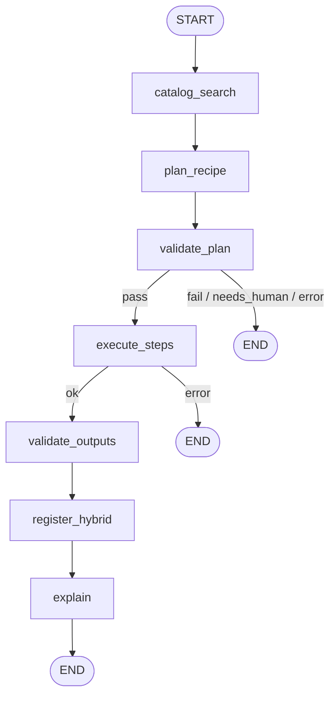
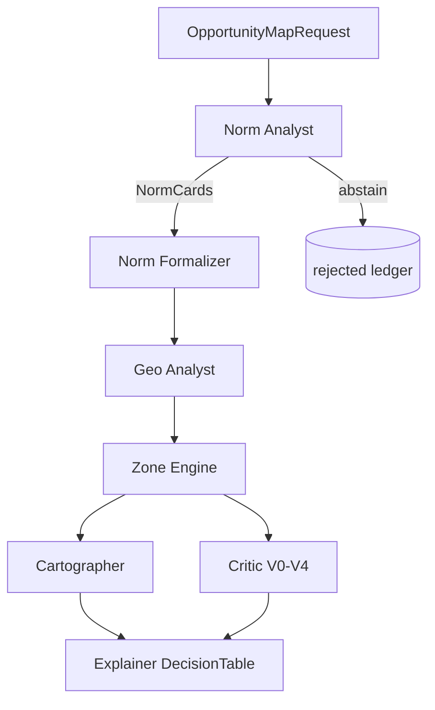
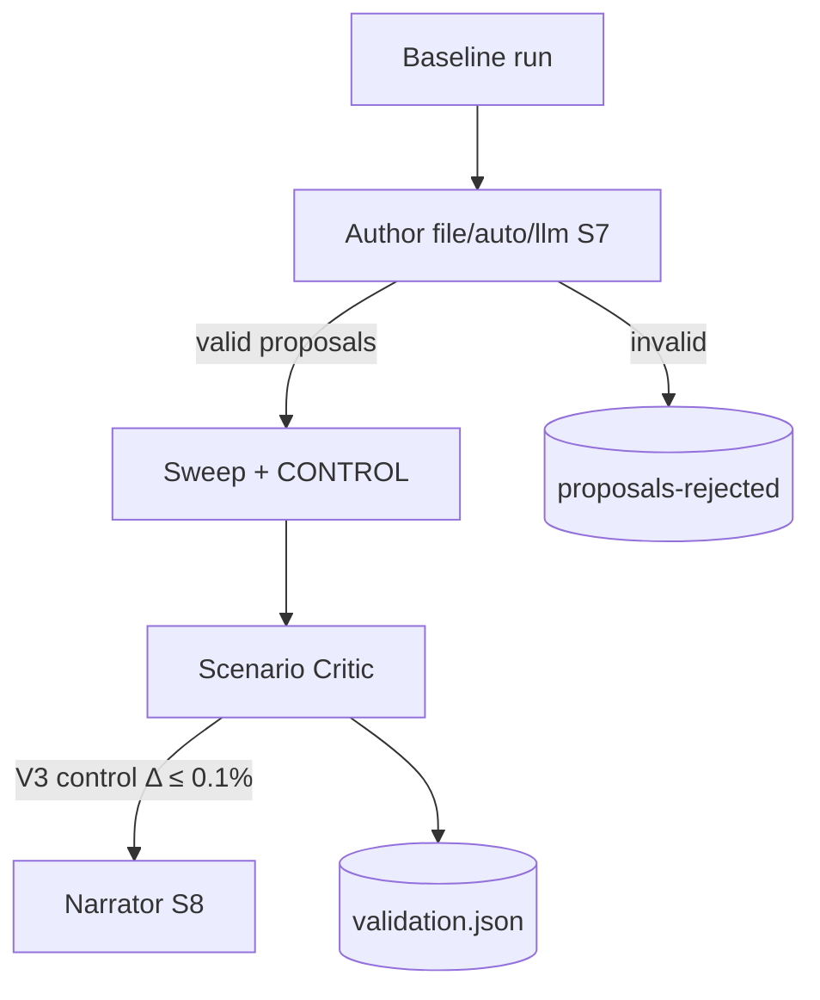

# 05 — Agentic AI layer

## Architecture

The agentic layer orchestrates discovery, planning, execution and validation —
**only via MCP** and nLDT interfaces (generic recipes), and via the
**PoC planes** for legal-spatial opportunity maps, scenarios and
crosstrack QA. Patterns: [11-poc-patterns-scenarios-qa.md](11-poc-patterns-scenarios-qa.md).

```
User request
     │
     ├──────────────────────────────┐
     ▼                              ▼
┌─────────────┐              ┌──────────────────┐
│ Orchestrator│  LangGraph   │ PoC planes A/B/C │
│  (recipes)  │              │ opportunity /    │
└──────┬──────┘              │ scenario / xtrack│
       │                     └────────┬─────────┘
   ┌───┴───┬──────────┬─────────┐     │
   ▼       ▼          ▼         ▼     ▼
Catalog  Recipe    Process   Critic  Norm Analyst → Formalizer
Navigator Planner  Executor          Zone Engine → Explainer DT
   │       │          │         │
   └─ nldt-catalog-mcp ─────────┘
   └─ nldt-process-mcp ────────┘
```

## Agent roster (generic nLDT)

| Agent | Module | Role |
|-------|--------|------|
| **Orchestrator** | `agents/orchestrator/graph.py` | State graph: plan → execute → validate → explain |
| **Catalog Navigator** | `agents/orchestrator/nodes/catalog.py` | Searches records/recipes/processes |
| **Recipe Planner** | `agents/orchestrator/nodes/planner.py` | Matches request → `AgentPlan` |
| **Process Executor** | `agents/orchestrator/nodes/executor.py` | Runs steps via process MCP/client |
| **Critic** | `agents/orchestrator/nodes/critic.py` | V0–V4 on plan + outputs |
| **Explainer** | `agents/orchestrator/nodes/explainer.py` | PROV + human-readable summary |

## Agent roster (PoC — plane A/B/C)

| Agent | Module | Plane | Role |
|-------|--------|-------|------|
| **Norm Analyst** | `poc/pipeline/agents.py` | A | Cite-or-abstain → NormCards (+ reject ledger) |
| **Norm Formalizer** | `poc/pipeline/agents.py` | A | NormCards → FormalRules (no guessing predicates) |
| **Geo Analyst** | `poc/pipeline/geodata.py` | A | Zone-layers cache-first |
| **Zone Engine** | `poc/pipeline/engine.py` | A | Inclusion ∪ ∩ AOI − exclusions |
| **Cartographer** | `poc/pipeline/cartographer.py` | A | GeoJSON / GML |
| **Critic/Validator** | `poc/pipeline/critic.py` | A | V0–V4 legal + geometric + replay |
| **Explainer** | `poc/pipeline/explainer.py` | A | DecisionTable (each row → NormCard) + PROV |
| **Scenario Author** | `poc/pipeline/scenario_author.py` | B | Seam **S7** — proposals only |
| **Scenario Critic** | `poc/pipeline/scenarios.py` | B | Control reproduction + mutation grounding |
| **Crosstrack** | `poc/pipeline/crosstrack.py` | C | Pairwise conflicts; no decision |

## MCP servers

| Server | Tools | Port (stdio) |
|--------|-------|--------------|
| `nldt-catalog-mcp` | `search_records`, `get_record`, `list_processes` | stdio |
| `nldt-process-mcp` | `describe_process`, `execute_process`, `get_job_status` | stdio |

Configuration via env:

- `NLDT_CATALOG_URL` (default `http://localhost:8083`)
- `NLDT_PROCESS_URL` (default `http://localhost:8082`)

Start MCP servers:

```bash
python -m services.mcp_servers.catalog_server
python -m services.mcp_servers.process_server
```

## GenAI seams

| Seam | LLM role | Deterministic gate |
|------|----------|-------------------|
| S1 Recipe discovery ranking | Rank catalog hits | Top match = highest score + tag overlap |
| S2 NL → AgentPlan | Parse intent → JSON | JSON Schema validation |
| S3 Result narration | Summarize outputs | Cite job output keys only |
| **S7 Scenario author** | Policy/norm/hypothetical proposals | `ScenarioSpec` schema + reject ledger; engine computes Δ |
| **S8 Scenario narrative** | Readable scenario summary | Every number/id/verdict must appear in `scenario-report` |

Default: **no LLM** — planner uses keyword/tag matching; PoC Norm Analyst
is deterministic replay of a verified corpus. LLM via optional `llm_hook`
(`poc/pipeline/agents.py`, `scenario_author.py`).

## LangGraph flow (nLDT recipes)



Source: `agents/orchestrator/graph.py`. Checkpoints: `MemorySaver` (dev);
production → Postgres saver. HITL: `interrupt_before=["execute_steps"]`.

## Opportunity-map flow (PoC plane A)



## Scenario-sweep flow (PoC plane B)



Scenario types: `norm_variance` | `policy_variant` | `hypothetical`
(hypothetical = explicitly *not* legally grounded).

## Crosstrack flow (PoC plane C)

Controls per track → pairwise ∩ → conflict GeoJSON + shared zones.
Critic: V2 `not_applicable`; V4 `pending` (human arbitration).

## Orchestrator CLI

```bash
# nLDT recipe graph
python -m agents.orchestrator.run \
  --request "Voer spatial overlay analysis uit voor twee lagen" \
  --recipe spatial-overlay-analysis \
  --input layerAUri=file://./examples/layer-a.geojson \
  --input layerBUri=file://./examples/layer-b.geojson

# PoC planes (sibling package)
python3 poc/run.py --use-case zon
python3 poc/scenarios/run.py --use-case wind --author auto
python3 poc/crosstrack/run.py
```

## Observability

- Structured logging per node (`orchestrator.run_id`)
- PROV bundle per process job / PoC run (`prov.json`)
- Reject ledgers as first-class audit artifacts
- Future: OpenTelemetry GenAI semconv
