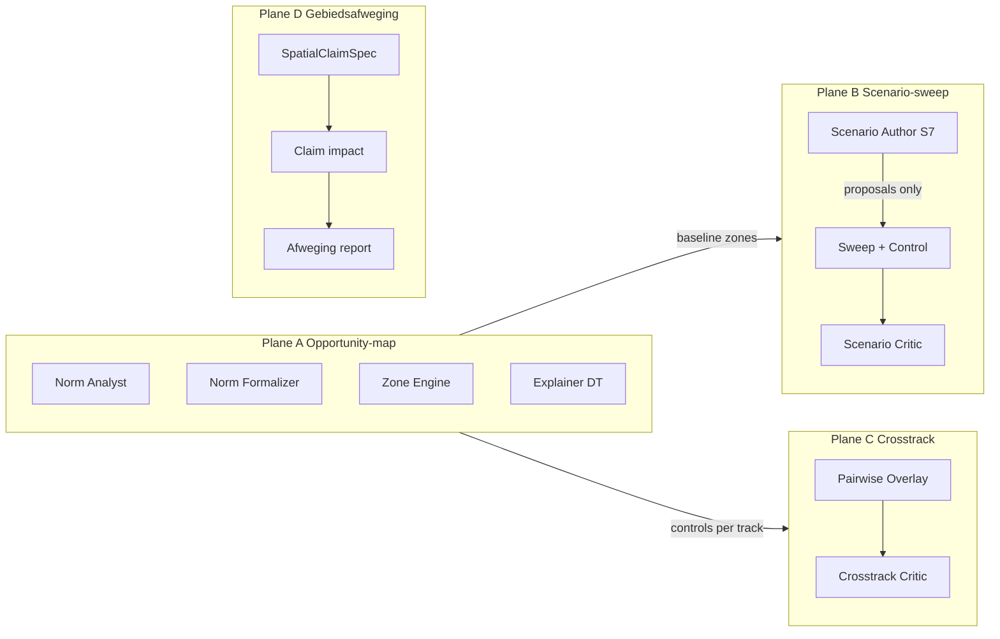
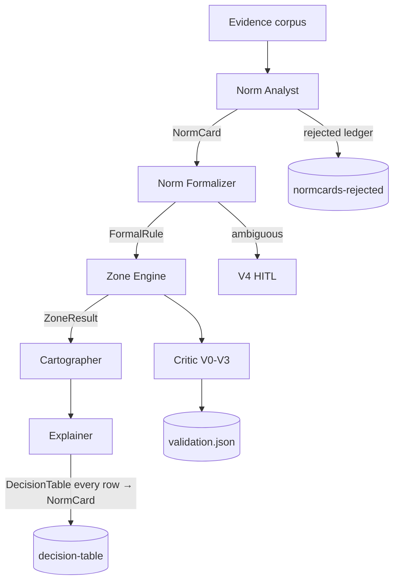

# 11 — PoC patterns: agentic scenarios & QA

Reference to the working PoC in [`../poc/`](../poc/) (Utrecht wind/solar/forest) and
[`../MULTI_AGENT_PLAN.md`](../MULTI_AGENT_PLAN.md) / [`../docs/GENAI_SEAMS.md`](../docs/GENAI_SEAMS.md).
This document **adapts the nLDT architecture**: the same patterns apply to
legal-spatial opportunity maps, scenario sweeps and cross-track QA —
alongside generic recipe orchestration (doc 05).

Leading principle (immutable):

> **AI proposes. The pipeline disposes. A human decides.**

---

## Four agentic planes

| Plane | Question | Orchestrator | Output |
|-------|----------|--------------|--------|
| **A. Opportunity-map** | Where is X allowed under the ordinance? | `poc/run.py` | `poc/runs/<ts>-<track>/` |
| **B. Scenario-sweep** | What if we change a rule/policy? | `poc/scenarios/run.py` | `poc/scenario-runs/` |
| **C. Crosstrack** | Where do tracks conflict (wind×solar×forest)? | `poc/crosstrack/run.py` | `poc/crosstrack-runs/` |
| **D. Gebiedsafweging** | What if we place a spatial claim (housing / dak-PV) against multiple values in one area? | `poc-breda/afweging_run.py` | `poc-breda/afweging-runs/` |

The nLDT generic stack (`agents/orchestrator`) today mainly covers **GIS recipes**.
Planes A–C are the **legal-spatial agentic pattern**; Plane D is the
**integral area trade-off** pattern (Breda five-value scan + spatial claims)
that answers the ZoN demand for gebiedsafweging without a black-box optimizer.



---

## Pattern 1 — Cite-or-abstain

No legal claim without **docId + article + version + verbatim quote + URL**.
If that is missing → **no** NormCard; instead an entry in the reject ledger.

| Step | Pass | Abstain / reject |
|------|------|------------------|
| Norm Analyst | `verified: true` evidence → NormCard | `normcards-rejected.json` |
| Norm Formalizer | template → FormalRule | `ambiguous` / do not guess predicates |
| Scenario Author (S7) | schema-valid proposal | `proposals-rejected.json` |
| Narrative (S8) | every number/id in report | `narrative-rejected.md` |

**nLDT mapping:** Explainer may only cite keys/ids that appear in job output or
corpus (same gate as S3 in doc 05).

---

## Pattern 2 — NormCard → FormalRule → Zone → DecisionTable



Zone semantics: `inclusion` | `exclusion` | `conditional` | `attention` |
`compensation` | `none`. Markers (`conditional`/`attention`/`compensation`)
**never** change the opportunity zone — overlays only.

---

## Pattern 3 — Scenario variants (GENAI seam S7)

| Base type | Meaning |
|-----------|---------|
| `baseline` | Control only (reserved) |
| `norm_variance` | Alternative reading of an existing norm |
| `policy_variant` | Flip a documented policy knob |
| `hypothetical` | No legal grounding — **must** say so |

Mutations (engine inputs only): `drop` | `set_semantics` | `set_buffer_distance_m`.

Authors: `--author file|auto|llm|hybrid`. Hybrid keeps the deterministic
golden set as floor and lets the LLM add novel mutation keys only. LLM
delivers **proposals** only on a fixed schema; the deterministic sweep
computes km²/IoU.

Control row is mandatory: unmutated re-run of the baseline.

---

## Pattern 4 — Crosstrack conflict overlay

- Re-run of **unmutated control** per track
- Pairwise intersect + shared instrument zones (e.g. Green contour)
- Quantifies conflict; **does not decide** (V4 = human arbitration)
- V2 = `not_applicable` (no new legal claims)

---

## Pattern 4b — Plane D gebiedsafweging (Breda)

- Baseline: five-value scan (`poc-breda`); control recompute must match (V3)
- Claims: `woningverdichting` | `dak_pv_maximalisatie` on selected buurten
  (`schemas/spatial-claim.schema.json`)
- Deterministic Δ per value; `capacityPressure` for housing; no LLM in numbers
- Output: `gebiedsafweging-report` + HTML; **no winnerClaimId** (V4 pending)
- Design: [`docs/superpowers/specs/2026-10-04-breda-gebiedsafweging-plane-d-design.md`](../docs/superpowers/specs/2026-10-04-breda-gebiedsafweging-plane-d-design.md)
- Recipe: `breda-gebiedsafweging`

---

## Pattern 5 — QA Critic V0–V4 (shared vocabulary)

| Level | Name | Opportunity-map (PoC) | Scenario-sweep | nLDT recipes |
|-------|------|----------------------|----------------|--------------|
| **V0** | Syntactic | JSON Schema all boundary artifacts | `scenario-report` schema | AgentPlan, Recipe, outputs |
| **V1** | Geometric | validity, CRS, area sanity | geometry per scenario row | GeoJSON validity |
| **V2** | Grounding | **Legal**: quote/doc/article; orphans | mutation↔ruleId, basis↔NormCard | Catalog: recipe/process ids |
| **V3** | Replay | IoU ≥ 0.98, area Δ ≤ 1% | control reproduction Δ ≤ 0.1% | Optional stats tolerance |
| **V4** | Human | Always `pending` in PoC | Scenario choice = human | HITL on high risk |

Verdict rollup: fail on V0–V3 fail; `needs_human` on skipped/degradations;
V4 does not block programming runs but remains visible.

See also [07-trust-and-governance.md](07-trust-and-governance.md).

---

## PoC agent roster ↔ nLDT agents

| PoC agent (plan §3.2) | Module | nLDT analogue |
|-----------------------|--------|---------------|
| Orchestrator | `poc/run.py` | `agents/orchestrator` |
| Norm Analyst | `pipeline/agents.py` | *(no node yet — plane A)* |
| Norm Formalizer | `pipeline/agents.py` | *(no node yet)* |
| Geo Analyst | `pipeline/geodata.py` | Process Executor + data MCP |
| Zone engine | `pipeline/engine.py` | Deterministic Cook / process |
| Cartographer | `pipeline/cartographer.py` | Process output + Context3D |
| Critic/Validator | `pipeline/critic.py` | `nodes/critic.py` (V0–V4) |
| Explainer | `pipeline/explainer.py` | `nodes/explainer.py` |
| Scenario Author | `scenario_author.py` | Seam S7 (new vs S1–S3) |
| Crosstrack | `crosstrack.py` | Multi-recipe / multi-AOI QA |

---

## GenAI seams (extended)

| Seam | Source | LLM may | Gate |
|------|--------|---------|------|
| S1–S3 | nLDT doc 05 | rank / plan / narrate recipes | Schema + cite job keys |
| **S7** | GENAI_SEAMS | Scenario proposals | Schema + reject ledger; engine computes |
| **S8** | GENAI_SEAMS | Scenario narrative | Every number/id must appear in report |

---

## Simulation bridge (Daltonlaan)

`simulation/corpus/` reuses **patterns 1–2** (NormCards + DecisionTable) for
zoning plan Rijnsweerd — structurally aligned, **not yet** wired to
live Critic/Formalizer. See architecture review canvas and doc 05 “gaps”.

## Open: one governed agent layer

The patterns above are **documentation**. Runtime unification across
`poc/`, `poc-bp2op/`, `poc-rijnland/`, `poc-breda/` via nLDT MCP is in
[12-governed-agent-layer.md](12-governed-agent-layer.md) (GENAI_SEAMS
*What’s next* §3 — **still to do**).

---

## Key paths

```
poc/run.py                          Plane A
poc/scenarios/run.py                Plane B
poc/crosstrack/run.py               Plane C
poc-breda/afweging_run.py           Plane D
poc-breda/breda/claims.py
poc-breda/schemas/{spatial-claim,gebiedsafweging-report}.schema.json
poc/pipeline/{agents,critic,engine,scenarios,scenario_author,crosstrack}.py
poc/schemas/{norm-card,formal-rule,decision-table,scenario-*,validation-report}.schema.json
docs/GENAI_SEAMS.md
MULTI_AGENT_PLAN.md §3.2 §4 §5
nldt/diagrams/agentic-planes.mmd
```
