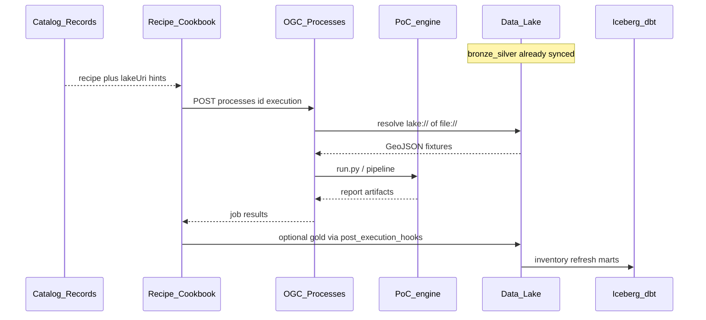

# 13 — Data lake & European Data Space

Hybrid architecture for all PoC data: **data lake** as the canonical technical
store, **European Data Space** as the publication/sharing layer. PoC engines remain
the source of truth for computations; filesystem working sets remain
for offline replay.

See plan *PoC Data Lake Space* and diagram
[`diagrams/data-lake-space.mmd`](diagrams/data-lake-space.mmd).
Overarching architecture hub (all views + links):
[`00-architecture.md`](00-architecture.md).

Leading principle (publication):

> AI proposes · pipeline disposes · human decides —
> Data Space offers for `restricted` or new dataset classes require HITL.

---

## Lake zones (medallion)

| Zone | Contents | Examples |
|------|----------|----------|
| **bronze** | Unchanged source snapshots | ArcGIS/PDOK downloads, WKP zips, CVDR HTML |
| **silver** | Normalised (dual-CRS GeoJSON, manifests, corpus JSON) | `*.28992.geojson`, `sources.json`, normcards |
| **gold** | Schema-valid run artifacts + PROV + ValidationReport | `zones.json`, `value-scan.json`, scenario reports |

### Object-key convention (S3-compatible)

```
s3://nldt-poc-lake/
  bronze/{poc}/{sourceId}/{retrievedAt}/...
  silver/{poc}/{layerOrCorpus}/{version}/...
  gold/{poc}/{runType}/{runId}/...
  catalog/dcat/{datasetId}.json
  offers/{offerId}.json
```

`poc` ∈ `utrecht` | `breda` | `eindhoven` | `rijnland`  
`runType` ∈ `run` | `scenario` | `crosstrack` | `qa`

Local (dev without MinIO): same layout under `nldt/data/lake/` via
`NLDT_LAKE_BACKEND=fs` (default).

---

## accessClass

| Class | Meaning | Data Space |
|-------|---------|------------|
| `open` | Open government data / explicitly shareable | May be a public offer |
| `internal` | nLDT participant only | Offer with policy `nldt-internal` |
| `restricted` | Do not publish automatically | **No** auto-offer; HITL required |

### Deny-list / defaults

| Path / asset | accessClass | Reason |
|--------------|-------------|--------|
| `poc-rijnland/data/peilen/` | `restricted` | Water-level history partly non-open |
| `poc-bp2op/corpus/` | `internal` | Offline-by-design until explicit release |
| Utrecht/Breda geo cache + gold runs | `open` | Open sources + derived zones/scans |
| H3 process cache | `internal` | Regenerable; no publication needed |

Config: [`data/lake-deny.json`](data/lake-deny.json).  
Inventory: [`data/lake-inventory.json`](data/lake-inventory.json) (generated).

---

## OGC Processes in the lake pipeline

The data lake is **not** a process runtime (no Spark/dbt as Cook).  
Execution follows AppStore → Cookbook → **Cook**
([04-recipes-and-processes.md](04-recipes-and-processes.md)): OGC API Processes
in `process_adapter`, which invoke PoC engines. The lake supplies **inputs**
(silver/bronze) and receives **outputs** (gold); Iceberg/dbt analyse
inventory metadata in parallel.

### Role split

| Layer | Role vs Processes |
|-------|-------------------|
| Bronze / silver | Input snapshots (`lake://…`, `s3://…`, or local cache after `lake_sync`) |
| OGC Processes (`process_adapter`) | Cook: GIS/H3 + PoC wrappers (`poc_handlers`) |
| Recipes / LangGraph | Orchestration of process steps |
| Gold | Run artifacts + PROV (sync or post-run hook) |
| Iceberg / dbt | Lakehouse over inventory — **not** a water-level/zone engine |
| `lake-publish-dataset` | Process that creates a Data Space offer over a lake URI |

### Execution path



1. **Ingest** — sources → bronze/silver (`lake_sync.py`), separate from process jobs.
2. **Discover** — OGC Records: process, recipe and dataset records with `lakeUri`.
3. **Execute** — `POST /processes/{id}/execution` or `execute_local`;
   `_load_source` accepts `file://`, `lake://`, `s3://`.
4. **Engine = SoT** — e.g. `rijnland-peil-conflict` → `poc-rijnland/run.py`
   (cache-first); lake is snapshot/sharing layer, not a compute cluster.
5. **Write-back** — artifacts under `poc-*/runs/…`; to gold via
   `lake_sync` and/or `upload_execution_gold` when `NLDT_LAKE_POST_RUN=1`.
6. **Lakehouse** — `lake_lakehouse_refresh.py` (inventory → Iceberg → dbt);
   does not replace process logic.

### Examples

| processId | Lake touchpoint |
|-----------|-----------------|
| `fetch-features` | May use `lake://` / `s3://` as `source` |
| `rijnland-peil-conflict` | Reads Rijnland silver/cache; gold run dir; hint to ArcGIS bronze |
| `breda-scan-run` / `opportunity-map-run` | Replay/execute; gold sync of runs |
| `lake-publish-dataset` | Offer over gold/silver URI; refuses `restricted` without HITL |

Diagram: [`diagrams/data-lake-space.mmd`](diagrams/data-lake-space.mmd).

---

## Lakehouse stack (DuckDB + Iceberg + dbt Core)

Technical choice for analyse/transform over the object store (laptop → cluster):

| Layer | Tool | Role |
|-------|------|------|
| Object store | FS or MinIO/S3 | bronze/silver/gold blobs |
| Table format | **Apache Iceberg** | versioned tables (`iceberg/` warehouse), time-travel |
| Query engine | **DuckDB** (+ `httpfs` / `iceberg`) | SQL on Parquet/Iceberg without a Spark cluster |
| Transforms | **dbt Core** (`dbt-duckdb`) | staging → marts over inventory/gold metadata |

Rationale: DuckDB enables lakehouse SQL on one laptop (Parquet/Iceberg/S3);
Iceberg provides schema evolution and snapshots; dbt Core versions transforms
as code (no vendor warehouse needed at PoC scale).

```bash
# Inventory + Iceberg + dbt (one shot)
PYTHONPATH=. python scripts/lake_lakehouse_refresh.py

# DuckDB CLI over inventory parquet
PYTHONPATH=. python -c "from services.lake import duckdb_connect, register_inventory_view; \
c=duckdb_connect(); register_inventory_view(c); print(c.execute('select poc, count(*) from lake_dataset_rows group by 1').fetchall())"

# Iceberg warehouse only
PYTHONPATH=. python scripts/lake_iceberg_bootstrap.py --force

# dbt marts
cd dbt_lake && dbt run --profiles-dir .
```

Iceberg: PyIceberg ``SqlCatalog`` → `data/lake/nldt-poc-lake/iceberg/`
(`lake.inventory`). dbt reads the Parquet mirror (fast path). Project:
[`dbt_lake/`](dbt_lake/).

---

## Internal catalog (DCAT / OGC Records)

Dataset records in catalog_adapter contain at least:

- `poc`, `zone` (bronze|silver|gold), `accessClass`
- `license`, `crs` (where applicable), `sha256`
- `retrievedAt` / `generatedAt`, `hadPrimarySource`
- `lakeUri` (`lake://…` or `s3://…`)

---

## Data Space participant

1. **Identity** — Keycloak/OIDC (existing toolbox path).
2. **Connector** — pluggable (`services/adapters/dataspace_connector.py`):
   - `NLDT_DATASPACE_CONNECTOR=mock` (default) — local registry
   - `edc-manifest` — Eclipse Dataspace Connector–shaped Asset +
     ContractDefinition JSON under `data/dataspace/edc-manifests/`
   - `http` — POST to `NLDT_EDC_MANAGEMENT_URL/v3/assets`; on missing URL or
     transport error, writes the same manifest as fallback
3. **Policies** — ODRL stub per offer (`schemas/dataspace-offer.schema.json`),
   schema-validated before persistence.
4. **Publish** — process `lake-publish-dataset` + recipe `lake-publish-offer`;
   refuses `restricted` without `forceHitlApproved=true`.
5. **Critic / HITL** — every publish returns a `ValidationReport` (V0 schema,
   V2 access gate, V4 HITL for restricted). Orchestrator reuses the same
   report shape as PoC recipes.

```bash
# Open offer (orchestrator, offline)
NLDT_OFFLINE=1 PYTHONPATH=. python -m agents.orchestrator.run \
  --request "Publish gold" --recipe lake-publish-offer \
  --input lakeUri=lake://nldt-poc-lake/gold/utrecht/run/demo/out.json \
  --input accessClass=open --input datasetId=demo-open \
  --no-register-pv --no-export-3d

# Restricted with HITL already recorded
NLDT_DATASPACE_CONNECTOR=edc-manifest PYTHONPATH=. python -c "
from services.lake.publish import publish_dataset
print(publish_dataset(
  lake_uri='lake://nldt-poc-lake/bronze/rijnland/peilen/x.json',
  access_class='restricted', force_hitl_approved=True,
  dataset_id='peilen')['connector'])
"
```
---

## nLDT integration

| Component | Role |
|-----------|------|
| `scripts/lake_sync.py` | Filesystem → lake (idempotent, sha256) |
| `scripts/build_lake_inventory.py` | Generate inventory |
| `scripts/lake_lakehouse_refresh.py` | Inventory → Iceberg → dbt |
| `services/lake/` | Client (fs/S3), sync, Iceberg, publish |
| `poc_handlers` / `_load_source` | Read `file://`, `lake://`, `s3://` |
| `hybrid_bridge.post_execution_hooks` | Optional gold upload after recipe run (`NLDT_LAKE_POST_RUN`) |
| OGC Processes (Cook) | Execution **outside** lake; see [§ OGC Processes](#ogc-processes-in-the-lake-pipeline) |

---

## Operations (dev)

```bash
# Refresh inventory
PYTHONPATH=. python scripts/build_lake_inventory.py

# Sync Utrecht+Breda to local lake
PYTHONPATH=. python scripts/lake_sync.py --poc utrecht --poc breda

# MinIO (optional)
docker compose -f docker-compose.lake.yml up -d
export NLDT_LAKE_BACKEND=s3
export NLDT_LAKE_ENDPOINT=http://127.0.0.1:9000
export NLDT_LAKE_ACCESS_KEY=minioadmin
export NLDT_LAKE_SECRET_KEY=minioadmin
export NLDT_LAKE_BUCKET=nldt-poc-lake
PYTHONPATH=. python scripts/lake_sync.py --poc utrecht
```

---

## Governance

- No PII; keep CBS sentinels.
- Replay: silver + gold must continue to support V3 control reproduction.
- Retention (guideline): bronze 90d hot; gold indefinite; H3 regenerable.
