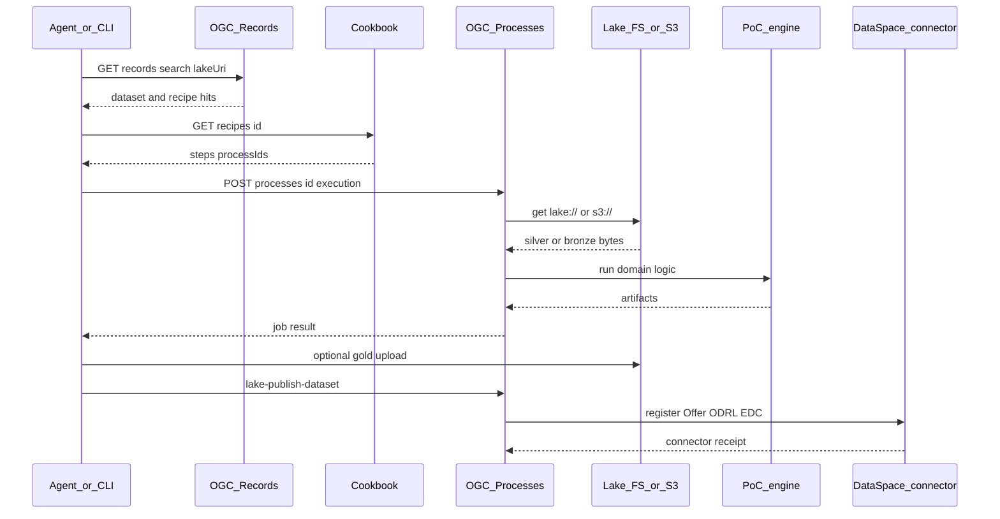
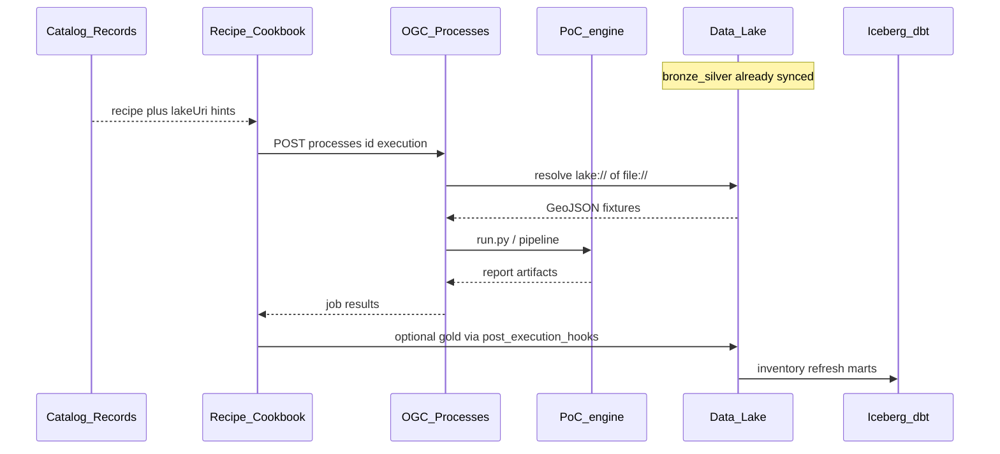

# 13 — Data lake & European Data Space

Hybrid architecture for all PoC data: **data lake** as the canonical technical
store, **European Data Space** as the publication/sharing layer. PoC engines remain
the source of truth for computations; filesystem working sets remain
for offline replay.

See plan *PoC Data Lake Space* and diagram
[`diagrams/data-lake-space.mmd`](diagrams/data-lake-space.mmd).
Overarching architecture hub (all views + links):
[`00-architecture.md`](00-architecture.md).

Leading principle (publication):

> AI proposes · pipeline disposes · human decides —
> Data Space offers for `restricted` or new dataset classes require HITL.

---

## Lake zones (medallion)

The lake uses the **medallion** pattern: three quality layers that answer
*how trusted and how usable* a blob is. Data only moves “up” when a pipeline
or human gate has done work; engines never write gold by accident.

| Zone | Meaning | What may change | Who writes | Who reads |
|------|---------|-----------------|------------|-----------|
| **bronze** | **Raw landing zone.** Exact copy of what the source delivered (bytes as received). No schema rewrite, no CRS transform, no business logic. | Only packaging (folder + timestamp + sha256). Content = source. | Ingest (`lake_sync`, DONL harvest, ArcGIS/PDOK downloaders) | Replay, audit, re-normalise, provenance |
| **silver** | **Curated working data.** Normalised for nLDT: stable schemas, dual CRS where geo, manifests, service pointers. Still *source-faithful*, not yet a twin run result. | Geometry CRS, field names, JSON shape, DCAT/service manifests | Normalisers / harvest silver step | Cook (`process_adapter`), agents, catalog |
| **gold** | **Validated products.** Schema-valid run outputs with PROV + ValidationReport. Safe to cite, publish (per `accessClass`), and reproduce. | Full derivation; must carry lineage | Cook post-hooks / recipe runs (`NLDT_LAKE_POST_RUN`) | Catalog, Data Space offers, QA, lakehouse marts |

```text
  source API / file
        │  unchanged snapshot
        ▼
     BRONZE   ← “what did we get?”
        │  normalise / dual-CRS / DCAT
        ▼
     SILVER   ← “what can the twin use?”
        │  OGC Process + PoC engine
        ▼
      GOLD    ← “what did we decide / compute?”
```

### Bronze — “as received”

- **Purpose:** forensic and regenerable landing. If PDOK or DONL changes tomorrow, bronze still holds *this* retrieval.
- **Examples:** ArcGIS FeatureServer dumps, WKP zips, CVDR HTML, DONL `package.json`, downloaded CSV/ZIP.
- **Rules:** do not overwrite in place; version by `{retrievedAt}` (or sha256). Prefer not to publish bronze as a Data Space offer (metadata/catalog or silver/gold instead).

### Silver — “ready for cook”

- **Purpose:** inputs the Cook and agents can load without knowing each source’s quirks.
- **Examples:** `*.28992.geojson` + `*.4326.geojson`, `sources.json`, DONL `DataService` manifests, normcards.
- **Rules:** must be deterministic from bronze (or declared registry). CRS and license recorded in catalog/`lakeUri` metadata.

### Gold — “ready to trust and share”

- **Purpose:** outputs of recipes/processes that passed schema (V0) and trust gates where applicable.
- **Examples:** `zones.json`, `value-scan.json`, scenario reports, peil-conflict runs, PROV + ValidationReport sidecars.
- **Rules:** gold implies a `runId` / recipe; default publish candidate when `accessClass=open`. `restricted` still needs HITL.

### Object-key convention (S3-compatible)

```
s3://nldt-poc-lake/
  bronze/{poc}/{sourceId}/{retrievedAt}/...
  silver/{poc}/{layerOrCorpus}/{version}/...
  gold/{poc}/{runType}/{runId}/...
  catalog/dcat/{datasetId}.json
  offers/{offerId}.json
```

`poc` ∈ `utrecht` | `breda` | `eindhoven` | `rijnland` | `donl`  
`runType` ∈ `run` | `scenario` | `crosstrack` | `qa`

Local (dev without MinIO): same layout under `nldt/data/lake/` via
`NLDT_LAKE_BACKEND=fs` (default).

---

## Communication protocol

Components do **not** share a private RPC. They talk through a small set of
**open interfaces** and **URI schemes**. The lake is storage; discovery and
execution use OGC-shaped HTTP APIs; sharing with other participants uses the
EU Data Space connector path (EDC-shaped).

### URI schemes (data plane)

| Scheme | Meaning | Resolver |
|--------|---------|----------|
| `file://…` | Local filesystem path (offline / PoC cache) | path as-is |
| `lake://nldt-poc-lake/{key}` | Logical object in the medallion store | `services.lake.get_lake_client` (FS or S3) |
| `s3://nldt-poc-lake/{key}` | Same object on MinIO/S3 | S3 client (`NLDT_LAKE_*`) |

`_load_source` in the process adapter accepts all three. Recipes and catalog
records prefer `lakeUri` so the same recipe works on laptop (FS) and cluster (S3).

### Control-plane APIs (nLDT triangle)

| Role | Protocol | Default | Speaks to |
|------|----------|---------|-----------|
| **AppStore** | OGC API **Records** (HTTP JSON) | `:8083` | Catalog: processes, recipes, datasets (`lakeUri`, `accessClass`) |
| **Cookbook** | Recipe JSON over HTTP | `:8081` | Recipe defs (`requiredProcesses`, step wiring) |
| **Cook** | OGC API **Processes** (`POST /processes/{id}/execution`) | `:8082` | Execute steps; resolve URIs; call PoC engines |

Agents (LangGraph / MCP) call the same surfaces: search Records → load recipe →
execute process steps. Offline mode (`NLDT_OFFLINE=1`) loads recipes from disk
and calls `execute_local` without HTTP.



### Data Space protocol (share plane)

Publication is a separate handshake from Cook:

1. **Catalog** exposes a dataset Record with `lakeUri` + `accessClass`.
2. Process **`lake-publish-dataset`** builds an ODRL-stub **Offer**
   ([`schemas/dataspace-offer.schema.json`](schemas/dataspace-offer.schema.json)).
3. **Connector** ([`dataspace_connector.py`](services/adapters/dataspace_connector.py)):
   - `mock` — local registry only  
   - `edc-manifest` — Eclipse Dataspace Connector–shaped Asset + ContractDefinition JSON  
   - `http` — EDC Management API `POST …/v3/assets` (fallback to manifest on error)
4. Identity for real participants: Keycloak/OIDC (toolbox); contract negotiation
   remains with the EDC/DSR stack when live (`NLDT_EDC_MANAGEMENT_URL` / DSR).

Inside the org, Cook reads the lake directly. Across organisations, peers
negotiate via the connector; they do **not** get raw MinIO credentials.

### Message shapes (contracts)

| Artifact | Where | Role in the protocol |
|----------|-------|----------------------|
| Recipe | `schemas/recipe.schema.json` | Orchestration contract (steps → processIds) |
| Process I/O | OGC Processes execute body | Runtime inputs (`lakeUri`, AOI, flags) |
| ValidationReport | `schemas/validation-report.schema.json` | Critic / HITL verdict on gold & offers |
| DCAT record | `catalog/dcat/{id}.json` | Dataset discovery (DONL + inventory) |
| Offer | `schemas/dataspace-offer.schema.json` | Share request (ODRL stub + `lakeUri`) |

### What is *not* the protocol

- The lake is **not** a message bus; no Kafka required for Cook ↔ lake.
- Iceberg/dbt are **analytics** over inventory, not the twin execution protocol.
- DONL CKAN is **ingest discovery** only; FSC/Digikoppeling is out of band for G2G.

---

## accessClass

| Class | Meaning | Data Space |
|-------|---------|------------|
| `open` | Open government data / explicitly shareable | May be a public offer |
| `internal` | nLDT participant only | Offer with policy `nldt-internal` |
| `restricted` | Do not publish automatically | **No** auto-offer; HITL required |

### Deny-list / defaults

| Path / asset | accessClass | Reason |
|--------------|-------------|--------|
| `poc-rijnland/data/peilen/` | `restricted` | Water-level history partly non-open |
| `poc-bp2op/corpus/` | `internal` | Offline-by-design until explicit release |
| Utrecht/Breda geo cache + gold runs | `open` | Open sources + derived zones/scans |
| H3 process cache | `internal` | Regenerable; no publication needed |

Config: [`data/lake-deny.json`](data/lake-deny.json).  
Inventory: [`data/lake-inventory.json`](data/lake-inventory.json) (generated).

---

## OGC Processes in the lake pipeline

The data lake is **not** a process runtime (no Spark/dbt as Cook).  
Execution follows AppStore → Cookbook → **Cook**
([04-recipes-and-processes.md](04-recipes-and-processes.md)): OGC API Processes
in `process_adapter`, which invoke PoC engines. The lake supplies **inputs**
(silver/bronze) and receives **outputs** (gold); Iceberg/dbt analyse
inventory metadata in parallel.

### Role split

| Layer | Role vs Processes |
|-------|-------------------|
| Bronze / silver | Input snapshots (`lake://…`, `s3://…`, or local cache after `lake_sync`) |
| OGC Processes (`process_adapter`) | Cook: GIS/H3 + PoC wrappers (`poc_handlers`) |
| Recipes / LangGraph | Orchestration of process steps |
| Gold | Run artifacts + PROV (sync or post-run hook) |
| Iceberg / dbt | Lakehouse over inventory — **not** a water-level/zone engine |
| `lake-publish-dataset` | Process that creates a Data Space offer over a lake URI |

### Execution path



1. **Ingest** — sources → bronze/silver (`lake_sync.py`), separate from process jobs.
2. **Discover** — OGC Records: process, recipe and dataset records with `lakeUri`.
3. **Execute** — `POST /processes/{id}/execution` or `execute_local`;
   `_load_source` accepts `file://`, `lake://`, `s3://`.
4. **Engine = SoT** — e.g. `rijnland-peil-conflict` → `poc-rijnland/run.py`
   (cache-first); lake is snapshot/sharing layer, not a compute cluster.
5. **Write-back** — artifacts under `poc-*/runs/…`; to gold via
   `lake_sync` and/or `upload_execution_gold` when `NLDT_LAKE_POST_RUN=1`.
6. **Lakehouse** — `lake_lakehouse_refresh.py` (inventory → Iceberg → dbt);
   does not replace process logic.

### Examples

| processId | Lake touchpoint |
|-----------|-----------------|
| `fetch-features` | May use `lake://` / `s3://` as `source` |
| `rijnland-peil-conflict` | Reads Rijnland silver/cache; gold run dir; hint to ArcGIS bronze |
| `breda-scan-run` / `opportunity-map-run` | Replay/execute; gold sync of runs |
| `lake-publish-dataset` | Offer over gold/silver URI; refuses `restricted` without HITL |

Diagram: [`diagrams/data-lake-space.mmd`](diagrams/data-lake-space.mmd).

---

## Lakehouse stack (DuckDB + Iceberg + dbt Core)

Technical choice for analyse/transform over the object store (laptop → cluster):

| Layer | Tool | Role |
|-------|------|------|
| Object store | FS or MinIO/S3 | bronze/silver/gold blobs |
| Table format | **Apache Iceberg** | versioned tables (`iceberg/` warehouse), time-travel |
| Query engine | **DuckDB** (+ `httpfs` / `iceberg`) | SQL on Parquet/Iceberg without a Spark cluster |
| Transforms | **dbt Core** (`dbt-duckdb`) | staging → marts over inventory/gold metadata |

Rationale: DuckDB enables lakehouse SQL on one laptop (Parquet/Iceberg/S3);
Iceberg provides schema evolution and snapshots; dbt Core versions transforms
as code (no vendor warehouse needed at PoC scale).

```bash
# Inventory + Iceberg + dbt (one shot)
PYTHONPATH=. python scripts/lake_lakehouse_refresh.py

# DuckDB CLI over inventory parquet
PYTHONPATH=. python -c "from services.lake import duckdb_connect, register_inventory_view; \
c=duckdb_connect(); register_inventory_view(c); print(c.execute('select poc, count(*) from lake_dataset_rows group by 1').fetchall())"

# Iceberg warehouse only
PYTHONPATH=. python scripts/lake_iceberg_bootstrap.py --force

# dbt marts
cd dbt_lake && dbt run --profiles-dir .
```

Iceberg: PyIceberg ``SqlCatalog`` → `data/lake/nldt-poc-lake/iceberg/`
(`lake.inventory`). dbt reads the Parquet mirror (fast path). Project:
[`dbt_lake/`](dbt_lake/).

---

## Internal catalog (DCAT / OGC Records)

Dataset records in catalog_adapter contain at least:

- `poc`, `zone` (bronze|silver|gold), `accessClass`
- `license`, `crs` (where applicable), `sha256`
- `retrievedAt` / `generatedAt`, `hadPrimarySource`
- `lakeUri` (`lake://…` or `s3://…`)

---

## Data Space participant

1. **Identity** — Keycloak/OIDC (existing toolbox path).
2. **Connector** — pluggable (`services/adapters/dataspace_connector.py`):
   - `NLDT_DATASPACE_CONNECTOR=mock` (default) — local registry
   - `edc-manifest` — Eclipse Dataspace Connector–shaped Asset +
     ContractDefinition JSON under `data/dataspace/edc-manifests/`
   - `http` — POST to `NLDT_EDC_MANAGEMENT_URL/v3/assets`; on missing URL or
     transport error, writes the same manifest as fallback
3. **Policies** — ODRL stub per offer (`schemas/dataspace-offer.schema.json`),
   schema-validated before persistence.
4. **Publish** — process `lake-publish-dataset` + recipe `lake-publish-offer`;
   refuses `restricted` without `forceHitlApproved=true`.
5. **Critic / HITL** — every publish returns a `ValidationReport` (V0 schema,
   V2 access gate, V4 HITL for restricted). Orchestrator reuses the same
   report shape as PoC recipes.

```bash
# Open offer (orchestrator, offline)
NLDT_OFFLINE=1 PYTHONPATH=. python -m agents.orchestrator.run \
  --request "Publish gold" --recipe lake-publish-offer \
  --input lakeUri=lake://nldt-poc-lake/gold/utrecht/run/demo/out.json \
  --input accessClass=open --input datasetId=demo-open \
  --no-register-pv --no-export-3d

# Restricted with HITL already recorded
NLDT_DATASPACE_CONNECTOR=edc-manifest PYTHONPATH=. python -c "
from services.lake.publish import publish_dataset
print(publish_dataset(
  lake_uri='lake://nldt-poc-lake/bronze/rijnland/peilen/x.json',
  access_class='restricted', force_hitl_approved=True,
  dataset_id='peilen')['connector'])
"
```
---

## nLDT integration

| Component | Role |
|-----------|------|
| `scripts/lake_sync.py` | Filesystem → lake (idempotent, sha256) |
| `scripts/build_lake_inventory.py` | Generate inventory |
| `scripts/lake_lakehouse_refresh.py` | Inventory → Iceberg → dbt |
| `services/lake/` | Client (fs/S3), sync, Iceberg, publish |
| `poc_handlers` / `_load_source` | Read `file://`, `lake://`, `s3://` |
| `hybrid_bridge.post_execution_hooks` | Optional gold upload after recipe run (`NLDT_LAKE_POST_RUN`) |
| OGC Processes (Cook) | Execution **outside** lake; see [§ OGC Processes](#ogc-processes-in-the-lake-pipeline) |

---

## Operations (dev)

```bash
# Refresh inventory
PYTHONPATH=. python scripts/build_lake_inventory.py

# Sync Utrecht+Breda to local lake
PYTHONPATH=. python scripts/lake_sync.py --poc utrecht --poc breda

# MinIO (optional)
docker compose -f docker-compose.lake.yml up -d
export NLDT_LAKE_BACKEND=s3
export NLDT_LAKE_ENDPOINT=http://127.0.0.1:9000
export NLDT_LAKE_ACCESS_KEY=minioadmin
export NLDT_LAKE_SECRET_KEY=minioadmin
export NLDT_LAKE_BUCKET=nldt-poc-lake
PYTHONPATH=. python scripts/lake_sync.py --poc utrecht
```

---

## DONL (data.overheid.nl) harvest

National open-data discovery via **CKAN Action API** → medallion lake + DCAT catalog.
DONL is a metadata hub (not an object store); file payloads live at PDOK/CBS/gemeente URLs.

| Path | Contents |
|------|----------|
| `bronze/donl/ckan/{id}/{retrievedAt}/package.json` | Raw CKAN snapshot |
| `bronze/donl/{id}/files/{resourceId}/…` | Downloaded distributions (CSV/ZIP/…) |
| `silver/donl/services/{id}/manifest.json` | WFS/WMS/Atom as `DataService` (on-demand) |
| `catalog/dcat/{id}.json` | DCAT-AP-NL 3-shaped dataset record |
| `silver/donl/meta/harvest-registry.json` | Source-monitor registry (`metadata_modified`, resource URLs) |

**Distribution split:** downloads → bronze; services → silver manifest only (no blind WFS dump).

**Process / recipes:** `donl-harvest-run`, `donl-harvest-publish` (harvest + `lake-publish-dataset`).

**Watchlist:** [`data/donl-watchlist.json`](data/donl-watchlist.json) — curated pilot datasets.

**Source monitor:** watchlist entry `donl-pilot` probes CKAN `metadata_modified` + resource URL reachability ([17-source-monitor.md](17-source-monitor.md)).

---

## Cross-twin time-series + Elasticsearch discovery

Generic observation contract: [`schemas/timeseries-observation.schema.json`](schemas/timeseries-observation.schema.json).

| Path | Contents |
|------|----------|
| `bronze/timeseries/{sourceId}/…` | Raw open-data / PoC snapshots |
| `silver/timeseries/{seriesId}/year=YYYY/observations.jsonl` | Normalized observations |
| `silver/timeseries/{seriesId}/series.json` | Series metadata (inventory + Elasticsearch) |

**Ingest process / recipe:** `timeseries-ingest-run`, `timeseries-open-ingest` — first wave: Rijnland peilen/WKP + KNMI Gilze-Rijen (350) + CBS KWB Breda (PoC fields).

**Elasticsearch:** compose service in [`docker-compose.lake.yml`](docker-compose.lake.yml) (`localhost:9200`). Index `nldt-lake-v1` documents: `dataset`, `timeseries_series`, `scenario_gold`. Reindex: `PYTHONPATH=. python scripts/lake_elasticsearch_reindex.py`. Offline/dev: set `NLDT_ELASTICSEARCH_MOCK=1` (in-memory) or leave `NLDT_ELASTICSEARCH_URL` unset.

**MCP:** `search_lake_elasticsearch` (full-text) alongside `search_lake_datasets` (substring). Orchestrator `data_plane` prefers Elasticsearch for TS/scenario keywords; falls back to substring.

```bash
# Ingest curated TS wave (writes silver under NLDT_LAKE_FS_ROOT)
PYTHONPATH=. python -c "
from services.process_adapter.handlers import execute_local
print(execute_local('timeseries-ingest-run', {'maxPeilStations': 3}))
"

# Reindex discovery
NLDT_ELASTICSEARCH_MOCK=1 PYTHONPATH=. python scripts/lake_elasticsearch_reindex.py
```

```bash
# Harvest watchlist (metadata + downloads where configured)
PYTHONPATH=. python scripts/donl_harvest.py --metadata-only

# Single package offline test
PYTHONPATH=. python -m services.process_adapter.handlers  # or:
PYTHONPATH=. python -c "
from services.process_adapter.handlers import execute_local
print(execute_local('donl-harvest-run', {'packageId': 'demo-donl-dataset', 'metadataOnly': True}))
"

# End-to-end harvest + Data Space offer (EDC-manifest)
NLDT_DATASPACE_CONNECTOR=edc-manifest PYTHONPATH=. python -c "
from services.process_adapter.handlers import execute_local
print(execute_local('donl-harvest-run', {
  'packageId': 'demo-donl-dataset',
  'metadataOnly': True,
  'publishDatasetId': 'demo-donl-dataset',
  'accessClass': 'open',
})['publish']['status'])
"
```

Detail: [18-donl-harvest.md](18-donl-harvest.md).

---

## Governance

- No PII; keep CBS sentinels.
- Replay: silver + gold must continue to support V3 control reproduction.
- Retention (guideline): bronze 90d hot; gold indefinite; H3 regenerable.
