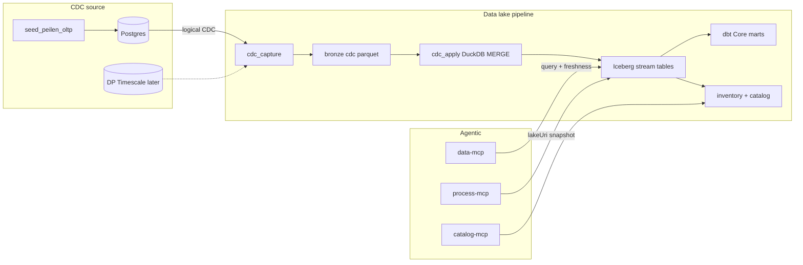

# 15 — CDC in the nLDT data lake pipeline (DuckDB · Iceberg · dbt Core)

> Status: **implemented (baseline)** — CDC outbox → bronze → DuckDB apply → dbt; no RisingWave.  
> Builds on [13-data-lake-and-space.md](13-data-lake-and-space.md) and the MCP dual-plane work.  
> **No RisingWave / no separate streaming database.** Streams = CDC changes applied into the existing lakehouse.

## Principle

Use **only** the data lake pipeline you already have:

```
OLTP (Postgres compose → later DP Timescale)
  → CDC capture → bronze change batches
  → DuckDB MERGE INTO Iceberg
  → dbt Core marts
  → catalog / MCP read / OGC Processes (Cook)
```

Doctrine unchanged: **AI proposes · pipeline disposes · human decides**.  
Agents never write to S3 or the CDC source DB.

---

## Scope

| In | Explicitly out |
|----|----------------|
| Postgres CDC source in compose (`wal_level=logical`) | RisingWave, Flink, Kafka Streams, Debezium/Kafka (unless a capture lib needs it internally) |
| CDC → `bronze/{poc}/cdc/…` Parquet | Sub-second continuous MV serving |
| DuckDB `MERGE INTO` Iceberg | Second streaming product |
| dbt incremental `merge` marts | Replacing PoC engines |
| MCP read + freshness on lake stream tables | Agent tools on OLTP |
| Connector profile for DP Timescale later | Live secrets in git |

Freshness SLA: **micro-batch** (e.g. refresh loop ≤60s in compose; on-demand via `lake_lakehouse_refresh.py`).

---

## Architecture



**Routing (MCP choice C, without a stream DB):**

| Question | Path |
|----------|------|
| Scenario / QA / gold | catalog + process / poc-mcp |
| NGSI / Trino federated | existing `data-mcp` |
| Near-real-time peilen from CDC | Iceberg/Parquet stream tables via lake MCP tools or process inputs |

---

## Phase A — CDC source + capture into bronze

### A.1 Compose

Extend [`docker-compose.lake.yml`](docker-compose.lake.yml):

- Keep MinIO
- Add `postgres-cdc` (`wal_level=logical`, publication on peilen table)
- **Do not** add RisingWave or other stream processors

### A.2 OLTP schema + seed

- `peilen_measurements` on Postgres
- `scripts/seed_peilen_oltp.py` — load restricted bronze peilen into OLTP via SQL
- Optional `scripts/simulate_peilen_updates.py` — UPDATEs to exercise CDC

### A.3 Capture → bronze

`scripts/cdc_capture_peilen.py` writes:

```
bronze/rijnland/cdc/peilen/{batch_id}.parquet
  op, peilgebied_id, waterstand_m, measured_at, cdc_lsn, captured_at
```

Profiles: `data/stream-cdc-profiles.json` (`local-compose` | `ldt-timescaledb`).

`accessClass=restricted` + deny-list same as existing peilen paths.

---

## Phase B — DuckDB MERGE + Iceberg + dbt (the lake pipeline)

### B.1 Apply

`scripts/cdc_apply_peilen.py`:

- Read new bronze CDC batches
- DuckDB `MERGE INTO` Iceberg table `stream.rijnland_peilen` (I/U/D)
- Fallback if Iceberg catalog write is awkward: merge into versioned Parquet under `silver/rijnland/peilen_latest/` then register in inventory

Wire into [`scripts/lake_lakehouse_refresh.py`](scripts/lake_lakehouse_refresh.py):

1. optional capture  
2. apply  
3. inventory  
4. Iceberg bootstrap/refresh as today  
5. `dbt run`

### B.2 dbt

| Model | Config | Role |
|-------|--------|------|
| `stg_rijnland_peilen_cdc` | staging | From Iceberg/Parquet |
| `mart_peil_latest` | `incremental` + `merge`, `unique_key=peilgebied_id` | Latest + `freshness_seconds` |

### B.3 Catalog / inventory

Dataset records: `zone=stream` (or silver `kind=cdc-applied`), `lakeUri`, `poc=rijnland`, `accessClass=restricted`.

---

## Phase C — MCP + live recipe (still lake-only)

### C.1 Tools on `data-mcp` (or catalog lake tools)

| Tool | Function |
|------|----------|
| `list_stream_tables` | Whitelist CDC-backed lake datasets |
| `query_stream_table` | Read-only query via DuckDB/lake client, row limit |
| `get_freshness` | Lag since last successful apply / max(measured_at) |

No tool talks to Postgres CDC source.

### C.2 Recipe

`rijnland-peil-conflict-live.json`: freshness → `lakeUri` snapshot → existing `rijnland-peil-conflict` → Critic + PROV + gold.

### C.3 Orchestrator

Keywords `peil` / `cdc` / `live` → hybrid; Critic fails if freshness over threshold.

---

## Files

| Path | Action |
|------|--------|
| `docker-compose.lake.yml` | `postgres-cdc` only (+ MinIO) |
| `scripts/sql/cdc_postgres_init.sql` | Logical replication + table |
| `scripts/seed_peilen_oltp.py` | Seed OLTP |
| `scripts/cdc_capture_peilen.py` | CDC → bronze |
| `scripts/cdc_apply_peilen.py` | DuckDB MERGE → Iceberg/silver |
| `scripts/lake_lakehouse_refresh.py` | Hook capture/apply |
| `data/stream-cdc-profiles.json` | Profiles |
| `data/stream-views.json` | MCP whitelist |
| `dbt_lake/models/staging/stg_rijnland_peilen_cdc.sql` | New |
| `dbt_lake/models/marts/mart_peil_latest.sql` | New |
| `services/adapters/stream.py` | Lake query + freshness (DuckDB) |
| `services/mcp_servers/data_server.py` | Stream read tools |
| `recipes/rijnland-peil-conflict-live.json` | New |
| `tests/test_cdc_lakehouse.py` | Capture → apply → mart |

---

## Acceptance criteria

1. OLTP INSERT/UPDATE appears as bronze CDC batch after capture  
2. Apply MERGEs into Iceberg/silver; readable via DuckDB  
3. `dbt run` produces `mart_peil_latest`  
4. MCP stream tools read-only; restricted gated; no OLTP exposure  
5. Live recipe → ValidationReport + PROV  
6. Stack = MinIO + Postgres + existing Python lake/dbt only — **no RisingWave**  
7. Existing lake/MCP tests green  

---

## Risks

| Risk | Mitigation |
|------|------------|
| Replication slots / WAL on laptop | Compose init + documented reset |
| Iceberg MERGE friction | Parquet silver fallback + inventory |
| “Live” expectations | Document micro-batch SLA; refresh on demand |

---

## Build order

1. Postgres CDC + seed  
2. Capture → bronze  
3. DuckDB apply + refresh hook  
4. dbt models  
5. MCP + live recipe + tests  
6. Docs / deploy note (Timescale profile)

Estimate: **~1–1.5 weeks** (1 dev).

---

## Rijnland what-if (implemented)

Scenario deltas on peilen archive → CDC bronze batch → DuckDB silver apply →
`whatif-report.json` + `whatif-diff.html` + **`whatif-map.html`** (Leaflet,
Breda-style scenario panel; modes na / vóór / Δ) + optional peil-conflict replay.

**Artefacts** (under `poc-rijnland/runs/<ts>-peilen-whatif/`):

| File | Role |
|------|------|
| `peilen-whatif.json` | Active scenario applied to peilen archive |
| `changes.json` / `whatif-diff.html` | Station delta table |
| `whatif-map.html` | Multi-scenario Leaflet map (default) |
| `whatif-report.json` | Summary + `mapHtml` / doctrine |
| `cdc-apply.json` | Present when lake apply ran |

Smoke (map): after a run, open `whatif-map.html` (needs network for
**jsDelivr Leaflet** + **Carto** basemap tiles — not OSM
`tile.openstreetmap.org`, which often returns 403). Default colour =
absolute peil **na** the selected scenario so uniform Δ still shows spatial
variation.

### Multi-scenario map (fase 2 — implemented)

Default map loads [`examples/rijnland-whatif-demo-pack.json`](examples/rijnland-whatif-demo-pack.json)
(boezem ±5 cm, polders +10 cm) plus the CLI/process scenario. Click scenario
cards to recolour client-side. Only the **active** scenario is written to
CDC/silver (`lakeApplied` badge on the panel). Doctrine: *AI proposes ·
pipeline disposes · human decides*.

```bash
cd nldt
PYTHONPATH=. .venv/bin/python scripts/rijnland_whatif_peilen.py \
  --delta-m 0.05 --layer boezem --no-conflict --no-lake
open ../poc-rijnland/runs/<ts>-peilen-whatif/whatif-map.html

# v1 single-scenario map (no demo pack):
PYTHONPATH=. .venv/bin/python scripts/rijnland_whatif_peilen.py \
  --delta-m 0.05 --layer boezem --no-demo-pack --no-lake --no-conflict
```

CLI flags: `--demo-pack PATH`, `--no-demo-pack`, `--no-lake`, `--no-conflict`.

Design / plan:

- [`docs/superpowers/specs/2026-09-14-rijnland-peilen-whatif-map-design.md`](../docs/superpowers/specs/2026-09-14-rijnland-peilen-whatif-map-design.md) (v1 map)
- [`docs/superpowers/specs/2026-09-14-rijnland-peilen-whatif-map-fase2-design.md`](../docs/superpowers/specs/2026-09-14-rijnland-peilen-whatif-map-fase2-design.md) (multi-scenario)

- Module: [`services/rijnland_whatif.py`](services/rijnland_whatif.py)
- CLI: [`scripts/rijnland_whatif_peilen.py`](scripts/rijnland_whatif_peilen.py)
- Process / recipe: `rijnland-peil-whatif`
- MCP alias: `run_peil_whatif`
- Examples: [`examples/rijnland-whatif-boezem-plus5cm.json`](examples/rijnland-whatif-boezem-plus5cm.json),
  [`examples/rijnland-whatif-demo-pack.json`](examples/rijnland-whatif-demo-pack.json)
- Tests: `tests/test_rijnland_whatif.py`

**Later (not done):** fase 3 hex / peil-conflict herattach on what-if peilen;
fase 4 MCP list/open artefact URI.

---

## Decision

| Choice | Value |
|--------|-------|
| Streaming product | **None** |
| How streams are generated | **CDC from OLTP** |
| Where they land | **bronze → DuckDB MERGE → Iceberg/silver → dbt** |
| Agent access | **Read lake/MCP only** |
