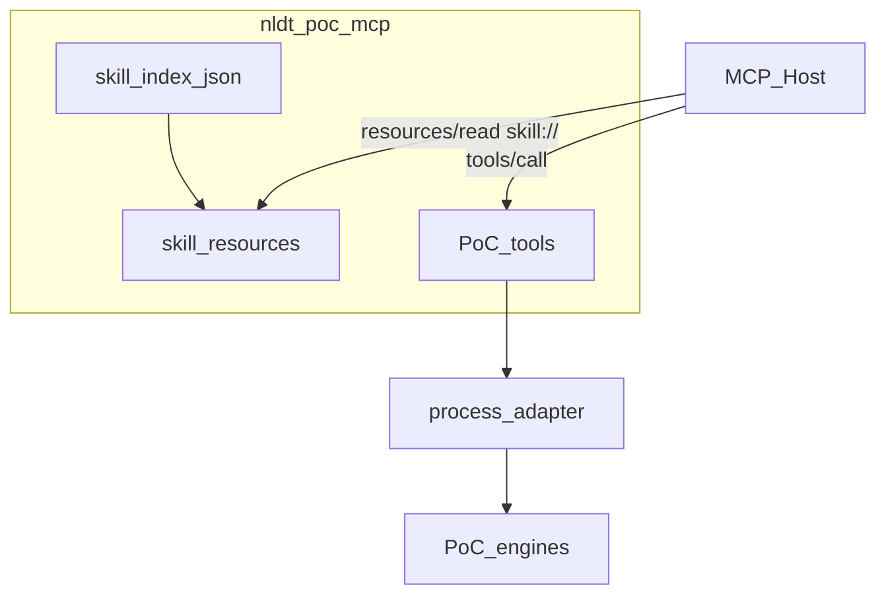
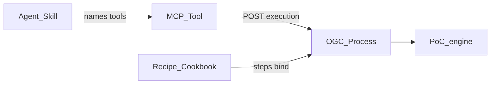

# 20 — PoCs via MCP + Skills (SEP-2640)

> Status: **skeleton** (2026-09-20).  
> Spec: [SEP-2640 Skills Extension](https://github.com/modelcontextprotocol/modelcontextprotocol/pull/2640) ·
> incubation [modelcontextprotocol/ext-skills](https://github.com/modelcontextprotocol/ext-skills).  
> Runtime: [`services/mcp_servers/poc_server.py`](services/mcp_servers/poc_server.py) (`nldt-poc-mcp`) +
> [`skills/poc/`](skills/poc/).
>
> **Interactive tour (EN):** open [`simulation/poc-mcp-skills.html`](simulation/poc-mcp-skills.html)
> (`?poc=lifecycle|router|breda|edic|utrecht|rijnland|eindhoven`).
> EDIC schematic with Breda as city illustration: `?poc=edic` and
> [`simulation/edic-breda-roadmap.html`](simulation/edic-breda-roadmap.html).
> Hub with **all** PoC demos:
> [`simulation/index.html`](simulation/index.html) (stories, agent flows, Rijnland map, Utrecht 3D/GIS).

## Problem

Phase 5 already exposes PoC **execution** as MCP tools (aliases over OGC Processes).
Hosts still lack **progressive workflow instructions**: when to call which tool, required
inputs, HITL expectations, and which artefacts prove a run. Server `instructions` are
too small for multi-PoC playbooks; shipping skills only as local filesystem packs
splits discovery from the tools they teach.

## Doctrine

**AI proposes · pipeline disposes · human decides.**

| Layer | Role | Location |
|-------|------|----------|
| **Agent Skill** | Teach *how* / *when* (untrusted model input) | `nldt/skills/poc/<name>/` |
| **MCP Tool** | Thin call alias | `poc_tools.py` / `poc_server.py` |
| **Process / Recipe** | Governed dispose + Critic / HITL / PROV | `poc_handlers.py`, catalog |
| **PoC engine** | Domain CLI | `poc/`, `poc-breda/`, … |
| **A2A `skillId`** | Cross-org agent card capability | `services/a2a` — **not** Agent Skills |

Skills never write zones/corpora, never bypass Critic, and never open a second
execution path. They only point at existing tools/processes.



## SEP-2640 binding (subset we implement)

- Extension id: `io.modelcontextprotocol/skills` (empty settings object).
- Each skill is a directory with root `SKILL.md` (YAML frontmatter `name` + `description`).
- Files exposed as MCP Resources under:

```
skill://nldt/poc/<skill-name>/SKILL.md
skill://nldt/poc/<skill-name>/references/…
skill://index.json
```

- Final path segment of the skill path **must** equal frontmatter `name`.
- Index entries use `type: "skill-md"`; `url` is the full `skill://…/SKILL.md` URI.
- Reading is standard `resources/read`. Skills are **not** executable.

Co-location: skills live on the **same** server as PoC tools (`nldt-poc-mcp`), so a host
that installs the server discovers companion playbooks with the tools.

## Skill ↔ tool ↔ process ↔ recipe

| Skill `name` | MCP tools | Process id(s) | Recipe id(s) |
|--------------|-----------|---------------|--------------|
| `nldt-poc-lifecycle` | Universal: discover → lake → scenarios → demo | catalog + process recipes | — |
| `nldt-poc-router` | (catalog) `list_poc_capabilities` | — | — |
| `breda-scan` | `run_value_scan`, `ask_scan` | `breda-scan-run`, `breda-scan-query` | `breda-five-value-scan`, `breda-scan-qa` |
| `utrecht-scenario` | `propose_scenarios`, `run_scenario_sweep` | `scenario-author-propose`, `scenario-sweep` | `utrecht-scenario-author`, `utrecht-scenario-sweep` |
| `utrecht-opportunity-map` | `run_opportunity_map` | `opportunity-map-run` | `utrecht-opportunity-map` |
| `utrecht-crosstrack` | `run_crosstrack` | `crosstrack-overlay` | `multi-track-crosstrack` |
| `rijnland-peilen` | `run_peil_*` | `rijnland-peil-*` | `rijnland-peil-*` |
| `eindhoven-bp2op` | `run_bp2op_transform` | `bp2op-transform` | `eindhoven-bp2op` |
| `breda-whatif` | *(later)* | LangGraph / process TBD | — |

Skeleton ships **router + lifecycle + breda-scan + utrecht-scenario + rijnland-peilen**; other rows are reserved names.

## Recipes (Cookbook) in detail

A **recipe** is the governed playbook the Cook executes: ordered steps, each bound to a
**processId**, with typed inputs/outputs and a `riskLevel`. Skills teach *when* to run;
tools alias *one* process execution; recipes are what the orchestrator / cookbook run
end-to-end (HITL, Critic, PROV). See also [04-recipes-and-processes.md](04-recipes-and-processes.md).



### Anatomy (`nldt/recipes/<id>.json`)

| Field | Meaning |
|-------|---------|
| `id` / `title` / `description` | Catalog identity |
| `requiredProcesses` | Process ids that must exist |
| `inputs` / `outputs` | Typed recipe contract (`${recipe.inputs.*}` wired into steps) |
| `steps[]` | Ordered Cook steps: `processId`, step `inputs`, `backend` |
| `riskLevel` | `low` \| `medium` \| `high` — **high** → plan HITL unless auto-approved |
| `tags` | Discovery (`poc-breda`, `cdc`, `phase-6`, …) |
| `cookbookUri` | Cookbook service URL |

PoC MCP tools usually skip the multi-step recipe runner and call **one** process directly;
running the **recipe** (orchestrator / cookbook) still applies uniform Critic + PROV + HITL.

### Lifecycle recipes (discover → lake → scenarios)

| Recipe id | risk | Process step(s) | Role |
|-----------|------|-----------------|------|
| `source-monitor-run` | **high** | `source-monitor-probe` | Continuity probes; never auto-applies registry (V4) |
| `donl-harvest-run` | medium | `donl-harvest-run` | data.overheid.nl → bronze + DCAT |
| `donl-harvest-publish` | **high** | `donl-harvest-run` (+ publish) | Harvest + Data Space offer |
| `timeseries-open-ingest` | medium | `timeseries-ingest-run` | Rijnland peilen (**all stations** by default) + WKP + KNMI + CBS → silver |
| `lake-publish-offer` | **high** | `lake-publish-dataset` | ODRL / EDC offer (HITL if restricted) |

### Domain PoC recipes

| Recipe id | risk | Process | Skill / tools |
|-----------|------|---------|---------------|
| `breda-five-value-scan` | medium | `breda-scan-run` | `breda-scan` / `run_value_scan` |
| `breda-scan-qa` | medium | `breda-scan-query` | `breda-scan` / `ask_scan` |
| `utrecht-scenario-author` | **high** | `scenario-author-propose` | `utrecht-scenario` / `propose_scenarios` |
| `utrecht-scenario-sweep` | **high** | `scenario-sweep` | `utrecht-scenario` / `run_scenario_sweep` |
| `utrecht-opportunity-map` | **high** | `opportunity-map-run` | reserved skill / `run_opportunity_map` |
| `multi-track-crosstrack` | **high** | `crosstrack-overlay` | reserved / `run_crosstrack` |
| `rijnland-peil-conflict` | medium | `rijnland-peil-conflict` | `rijnland-peilen` / `run_peil_conflict` |
| `rijnland-peil-conflict-live` | **high** | `rijnland-peil-conflict` | CDC lake snapshot path |
| `rijnland-peil-whatif` | **high** | `rijnland-peil-whatif` | `run_peil_whatif` (CDC + map) |
| `eindhoven-bp2op` | **high** | `bp2op-transform` | reserved / `run_bp2op_transform` |

### Spatial reference recipes

| Recipe id | risk | Steps (processes) |
|-----------|------|-------------------|
| `spatial-overlay-analysis` | low | fetch ×2 → intersect → area stats |
| `beleidskompas-omgevingsanalyse` | low | same overlay pattern, Beleidskompas tags |
| `hex-overlay-analysis` | low | fetch ×2 → H3 cells → join → Moran's I |

### How to run

```bash
# Recipe via orchestrator (Critic + PROV + HITL)
cd nldt
PYTHONPATH=. NLDT_OFFLINE=1 python -m agents.orchestrator.run \
  --recipe timeseries-open-ingest --auto-approve-hitl

# Single process via PoC MCP tool (thin alias)
# tools/call run_peil_whatif { "delta_m": 0.05, "layer": "boezem" }
```

Interactive explorer: [`simulation/poc-mcp-skills.html`](simulation/poc-mcp-skills.html) → **Recipes** panel
(risk, steps, inputs, linked skill). Lifecycle skill detail:
[`skills/poc/nldt-poc-lifecycle/references/recipes.md`](skills/poc/nldt-poc-lifecycle/references/recipes.md).

## On-disk layout

```
nldt/skills/poc/
  nldt-poc-lifecycle/SKILL.md
  nldt-poc-lifecycle/references/phase-*.md
  nldt-poc-router/SKILL.md
  breda-scan/SKILL.md
  breda-scan/references/inputs.md
  breda-scan/references/artifacts.md
  rijnland-peilen/SKILL.md
  rijnland-peilen/references/…
  utrecht-scenario/SKILL.md
  utrecht-scenario/references/inputs.md
  utrecht-scenario/references/artifacts.md
```

Helper: [`services/mcp_servers/skills_resources.py`](services/mcp_servers/skills_resources.py)
walks this tree, builds `skill://index.json`, and registers each file on the MCP server.

## Trust & security

- Skills = **untrusted model input** (SEP security). Reading a skill does not grant dispose.
- Tool calls still go through process-adapter jobs → Critic V0–V4 → HITL when `riskLevel: high`.
- Auth unchanged: `NLDT_MCP_BEARER_TOKEN` / wallet bearer via [`headers.py`](services/mcp_servers/headers.py).
- No secrets or live credentials in skill bodies.

## Host integration

1. Configure host MCP to run `nldt-poc-mcp` (stdio or streamable-http `:8093`).
2. Hosts with SEP-2640 hydrate skills from `skill://index.json` / `resources/read`.
3. Hosts without the extension still see listed resources + server `instructions` pointing at
   `skill://nldt/poc/nldt-poc-router/SKILL.md`.
4. Optional local mirror: same directories under a Cursor skills path — **one source of truth**
   remains `nldt/skills/poc/`.

## A2A vs Agent Skills

| | Agent Skills (this doc) | A2A skills |
|--|-------------------------|------------|
| Transport | MCP Resources `skill://` | Agent Card / `skillId` on `:8085` |
| Content | Markdown playbooks | Invoke recipe / 3D export |
| Consumer | Coding / MCP hosts | Peer agents |

Do not reuse A2A skill ids as Agent Skills `name` values without an explicit mapping table.

## Phasing

1. **Done (skeleton):** this doc, three skills, resource serving + index, unit tests.
2. **Fill:** remaining PoC skills from READMEs/recipes.
3. **Host pilot:** Cursor smoke — read skill → call tool → job + PROV.
4. **Later:** `.tar.gz` archive entries, `mcp-resource-template`, `breda-whatif` tool registration.

## Acceptance (skeleton)

- `resources/read` `skill://index.json` lists ≥3 skills.
- `resources/read` `skill://nldt/poc/breda-scan/SKILL.md` has frontmatter `name: breda-scan`.
- Existing `POC_TOOLS` registry unchanged in behaviour.
- No execution outside process-adapter.

## Related docs

- [12-governed-agent-layer.md](12-governed-agent-layer.md) — Phase 5 MCP tool surface
- [05-agentic-ai-layer.md](05-agentic-ai-layer.md) — seams + LangGraph
- [docs/GENAI_SEAMS.md](../docs/GENAI_SEAMS.md) — seam catalogue
- [19-s10-deep-research.md](19-s10-deep-research.md) — S10 hinter (orthogonal; not a PoC skill)
