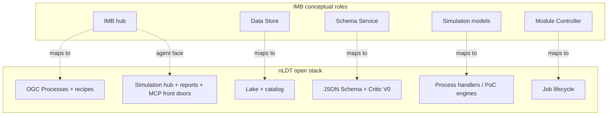

# 25 — IMB alignment: Inter Model Broker roles mapped onto nLDT

Urban Strategy (Scenexus) runs on the **Inter Model Broker (IMB)**
framework described in Lohman et al. (2023). This chapter records a
**conceptual** mapping only: how IMB roles correspond to nLDT building
blocks. It does **not** install or re-implement an IMB hub in this
repository.

| | |
|---|---|
| Status | Alignment note (2026-09-29) · documentation only — no IMB runtime |
| Primary sources | [Urban Strategy — Data exchange system](https://doc.urbanstrategy.nl/system/) · Lohman, W., Cornelissen, H., Borst, J., Klerkx, R., Araghi, Y., & Walraven, E. (2023). *Building digital twins of cities using the Inter Model Broker framework.* Future Generation Computer Systems, 148, 501–513 |
| Related | [00](00-architecture.md) · [04](04-recipes-and-processes.md) · [05](05-agentic-ai-layer.md) · [06](06-hybrid-implementation.md) · [13](13-data-lake-and-space.md) · [23](23-dtas-alignment.md) · [references/bibliography.md](references/bibliography.md) |
| Non-goal | Hosting Scenexus IMB, MC node, or US Server packages in-repo |

---

## 1. What IMB is

IMB is a messaging-oriented integration pattern for urban digital twins:

1. **IMB hub** — central broker for communication between components.
2. **Data Store** — in-memory / twin data, shaped by a **Schema Service**.
3. **Simulation models** — separate processes (local, Docker, or remote)
   that attach to the hub (e.g. traffic, air, noise).
4. **Module Controller (MC node)** — starts and stops models; operators
   use MC Control and/or the web UI.

In product form this stack ships inside **Urban Strategy**. There is no
standalone open-source IMB package to vendor into nLDT. Neighbouring open
work (e.g. [Urban Model Platform](https://github.com/Urban-Model-Platform/urban-model-platform))
uses **OGC API Processes** — the same external interface nLDT already
exposes.

---

## 2. Role mapping (IMB → nLDT)

| IMB role (Lohman / Scenexus) | nLDT equivalent | Where |
|---|---|---|
| IMB hub (inter-model messaging) | OGC API Processes + recipe runner; MCP / A2A for agents | [`services/process_adapter/`](services/process_adapter/), [`services/recipe_runner.py`](services/recipe_runner.py), [`services/mcp_servers/`](services/mcp_servers/), [05](05-agentic-ai-layer.md) |
| Data Store | Data lake + catalog (Iceberg / `lake://`, OGC Records) | [13](13-data-lake-and-space.md) |
| Schema Service | JSON Schema contracts + V0 validation | [`schemas/`](schemas/), [07](07-trust-and-governance.md) |
| Attached simulation models | Process handlers / PoC engines (local or Docker backend) | [`process_adapter/handlers.py`](services/process_adapter/handlers.py), [`poc_handlers.py`](services/process_adapter/poc_handlers.py) |
| Module Controller (lifecycle) | Job create / execute / results; Kubeflow adapter where used | [`process_adapter/jobs.py`](services/process_adapter/jobs.py), [`kubeflow_adapter.py`](services/process_adapter/kubeflow_adapter.py) |
| Operator / stakeholder UI | Simulation hub, run HTML reports, external front doors (MCP-mounted) | [`simulation/`](simulation/), [14](14-beleidskompas-integration.md), [22](22-dual-audience-spatial-planning.md) |

---

## 3. Deliberate differences

| Topic | IMB / Urban Strategy | nLDT |
|---|---|---|
| Coupling style | In-memory hub, product-native protocols | Standards-first (OGC, MCP, recipes); “wrap, don’t rebuild” |
| Vendor posture | Commercial DT platform (Scenexus) | Federated, leverancier-agnostic ([23](23-dtas-alignment.md), [24](24-zichtopnl-alignment.md)) |
| Agent layer | Web UI + tools around the hub | LangGraph / MCP with *LLMs propose · engines dispose* |
| Legal / policy models | Not IMB’s focus | Norm → FormalRule → Critic / RegelRecht-aligned PoCs |
| Offline / replay | Live twin + GPU models | Cache-first PoC runs, schema-validated artifacts, PROV |

nLDT is therefore an **open functional analogue** of IMB’s integration
roles, not a drop-in replacement for the Scenexus runtime.

---

## 4. What this chapter does *not* authorize

- Installing Urban Strategy Server / IMB hub / MC node in this repo.
- Reimplementing IMB messaging semantics as a new nLDT core service.
- Treating LLM outputs as substitutes for statutory calculation models
  (SRM noise/air, traffic assignment, etc.).

If a licensed Urban Strategy environment exists **elsewhere**, the
supported pattern remains: **optional external connector** (e.g. RestAPI)
behind the existing process facade — IMB stays at the vendor; nLDT stays
the federated interface. That connector is out of scope for this
alignment note.

---

## 5. Practical takeaway

When comparing or partnering with Urban Strategy / IMB:

1. Map conversations to the table in §2 (hub → processes, store → lake, …).
2. Keep statutory models behind deterministic process backends.
3. Use agents for orchestration, discovery, scenario authoring, and
   explanation — not for inventing physical quantities.
4. Prefer OGC Processes (+ MCP) as the public backbone, consistent with
   DTAS and European LDT tooling.
