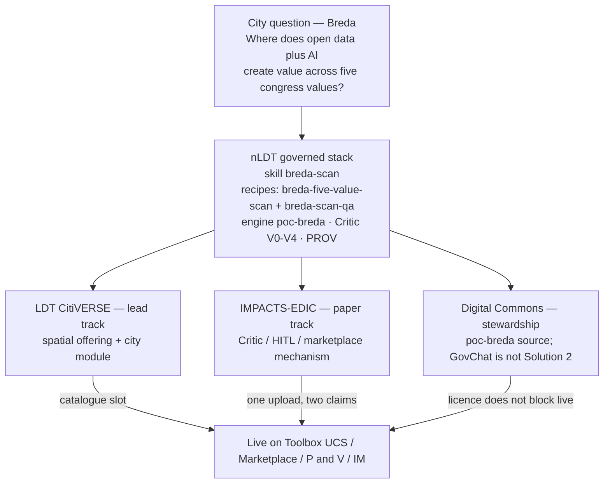
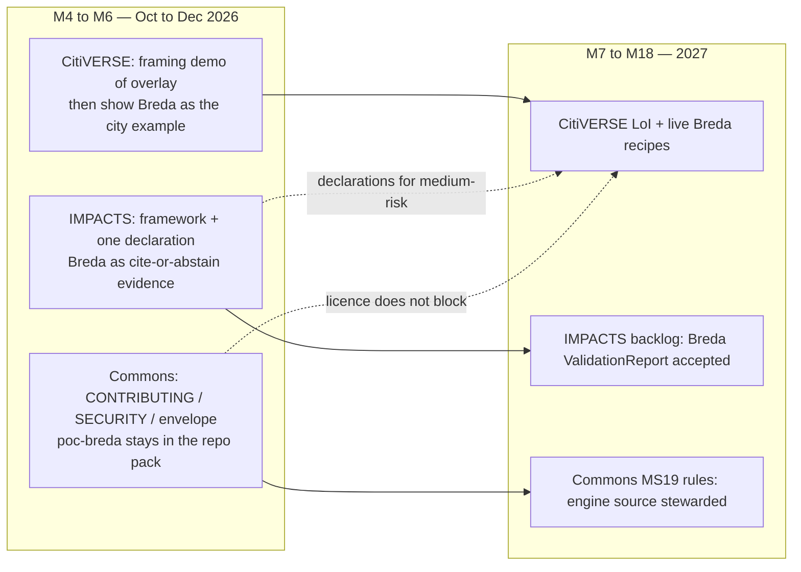
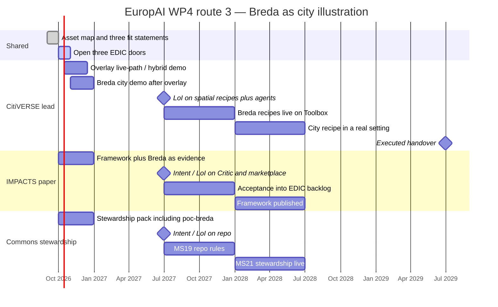
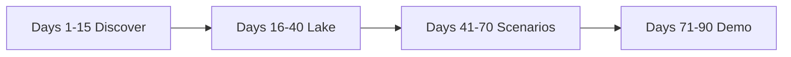
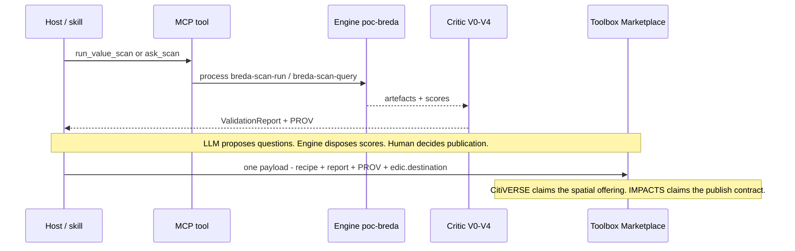
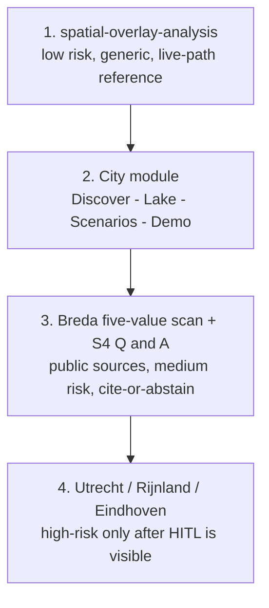

# Schematic route map — CitiVERSE-first, illustrated with Breda

English visual for the **M4–M6 framing dossier**. Operating model:
[route-citiverse-first.md](route-citiverse-first.md). Hub:
[21-europai-edic-handover.md](../21-europai-edic-handover.md).

Meeting page (same schematic, styled):
[simulation/edic-breda-roadmap.html](../simulation/edic-breda-roadmap.html).
Architecture website route:
[simulation/poc-mcp-skills.html?poc=edic](../simulation/poc-mcp-skills.html?poc=edic).

**Locked route:** three EDIC tracks in parallel. CitiVERSE is the first
*operational* landing. IMPACTS and Digital Commons start in the same month;
they lag on integration, not on contact. **Breda** is the city illustration
on the lead track — after the generic overlay, before high-risk Utrecht /
Rijnland / Eindhoven.

Doctrine: *LLMs propose · engines dispose · humans decide.*

Today is EuropAI **M3** (September 2026). Window **M4–M6** =
October–December 2026.

---

## 1. One picture: city question → three EDIC claims

Breda asks a public, medium-risk question. The same run produces **three
claims**, not three products. CitiVERSE owns the *spatial offering*.
IMPACTS owns the *publish contract*. Commons owns the *source*.

| What Breda *is* | What Breda *is not* |
|-----------------|---------------------|
| First **city** asset on the CitiVERSE lead (after `spatial-overlay-analysis`) | The first *Toolbox* demo — that remains the generic overlay |
| Evidence that cite-or-abstain + public sources work in a real municipality | A second marketplace id or an IMPACTS “city app” |
| Candidate for a TEF / CitCom.AI sandbox after hybrid→live | A reason to wait for SIMPL or NLAIF before the overlay demo |

Five congress values on the Breda scan: **democratic, spatial, economic,
social, autonomous**. Every score cites a named public source (CBS / PDOK /
data.breda.nl) or the Q&A **abstains**.

---

## 2. Three parallel tracks (Breda on each lane)

Tracks fail independently. A red Commons gate does not pause Breda on
CitiVERSE.

| Track | EDIC | Breda artefact they can point at | Cadence to M12 |
|-------|------|----------------------------------|----------------|
| **Lead** | LDT CitiVERSE | Recipes `breda-five-value-scan`, `breda-scan-qa`; skill `breda-scan`; city module | Demo M4–M6 (overlay first); Breda as city follow-up; LoI by M12 |
| **Paper** | IMPACTS | Same run’s Critic V0–V4, number gate, PROV, `edic.destination` on the payload | Fit + framework now; LoI by M12 |
| **Stewardship** | Digital Commons | Engine `poc-breda/` and skill text under EUPL-1.2 | Pack now; LoI by M12 |

Marketplace collision rule (unchanged): **one upload, two claims**. Do not
publish Breda once as a CitiVERSE city service and again as an IMPACTS
building block with a second marketplace id.

---

## 3. Timeline M4–M36 with Breda as the city illustration

Generic overlay is the *live-path* proof. Breda is the *city* proof.
High-risk PoCs wait until IMPACTS declarations are at least *proposed*
(they already sit on disk) and HITL is visible in the room.

If a track has no named counterpart **and** no next date at **M12**
(June 2027), switch **that track** to its fallback. Other tracks stay on
route 3. See [stage-gates.md](stage-gates.md).

| Gate | Window | What “green” looks like with Breda in the room |
|------|--------|------------------------------------------------|
| M4–M6 | Oct–Dec 2026 | Overlay demo honest about mock/hybrid. Breda shown as the *next* city asset: public sources, cite-or-abstain, no secrets in the HTML |
| M7–M12 | Jan–Jun 2027 | CitiVERSE written interest in the spatial class. Internally `edic_live_readiness` hybrid or live. Breda still hybrid is acceptable if overlay is the live reference |
| M13–M18 | Jul–Dec 2027 | EDIC-written acceptance. Breda recipes on the live path or explicitly scheduled. TEF/CitCom.AI slot asked for, not assumed |
| M19–M30 | 2028 H1 | One asset per EDIC in a real setting. Breda (or a city that reused the module) is the CitiVERSE exhibit |
| M31–M36 | to 30 Jun 2029 | Executed handover. Map 100% destination + owner + acceptance |

Fallbacks from M12, per track: CitiVERSE → VNG + Geonovum Cookbook;
IMPACTS → Interoperable Europe / EDIH; code → OS2.

---

## 4. How a city walks the route (Breda as the worked example)

The city-facing module is the same four phases for every municipality.
Breda is the filled-in row.

| Phase | Generic city module | Breda illustration |
|-------|---------------------|-------------------|
| **Discover** | Catalog search + source-monitor. Record `accessClass`. No restricted ingest | CBS Wijken en Buurten 2024, PDOK, data.breda.nl / geo.breda.nl — 100% public, no API keys |
| **Lake** | Bronze snapshot → silver convert. Gold only via registered processes | Scan gold artefacts; lake post when `NLDT_LAKE_POST_RUN=1`. Replay is the default for tests |
| **Scenarios** | One domain skill. Critic V0–V4 on every run | Skill `breda-scan` → `run_value_scan` / `ask_scan`. Engine computes five values. LLM may only narrate cited numbers |
| **Demo** | Static HTML under `nldt/simulation/`. Optional Marketplace publish with ValidationReport + PROV | Story, agent-flow, report map, 2050 what-if. Then publish recipes with `edic.destination = ldt-citiverse` |

Full sequence: [edic-city-onboarding.md](../skills/poc/nldt-poc-lifecycle/references/edic-city-onboarding.md).

---

## 5. Lead-track order (do not skip the overlay)

CitiVERSE backlog, with Breda as step 3:

1. **`spatial-overlay-analysis`** — first *working* asset on Toolbox.
2. **City module** — lifecycle + onboarding page.
3. **`breda-five-value-scan` / `breda-scan-qa`** — first *city* asset.
   Candidate for CitCom.AI / sandbox (M9–M24).
4. Utrecht scenario-sweep, Rijnland what-if, Eindhoven bp2op — later.

Laptop mocks are expected. `python -m scripts.edic_live_readiness` must
not be `mock` before anyone claims a live Toolbox overlay. Breda HTML
demos never embed secrets.

---

## 6. Asset register (Breda rows)

From [`recipes/edic-asset-map.json`](../recipes/edic-asset-map.json):

| id | EDIC | Class | Readiness | Risk | Proposed acceptance |
|----|------|-------|-----------|------|---------------------|
| `recipe:breda-five-value-scan` | ldt-citiverse | spatial-blueprint | hybrid | medium | Cite-or-abstain artefacts; ValidationReport V0–V4; city-facing capacity module |
| `recipe:breda-scan-qa` | ldt-citiverse | spatial-blueprint | hybrid | medium | S4 cite-or-abstain; number gate; PROV; Toolbox IM bearer on A2A |
| `skill:breda-scan` | ldt-citiverse | city-capacity-module | hybrid | — | SEP-2640 `skill://` resource; cite-or-abstain |

Owner: ICTU. Relationship owners: VLO + LNDS. Fallback: VNG + Geonovum
Cookbook.

---

## 7. What to open in the CitiVERSE room

After the overlay demo (15 min), spend five minutes on Breda as the
**city illustration** — not a second live-path claim unless readiness is
hybrid or live.

| Surface | Path |
|---------|------|
| This map | `nldt/edic/breda-route-map.md` |
| Meeting page | [`nldt/simulation/edic-breda-roadmap.html`](../simulation/edic-breda-roadmap.html) |
| Story | [`nldt/simulation/poc-breda.html`](../simulation/poc-breda.html) |
| Agent flow | [`nldt/simulation/breda-flow-demo.html`](../simulation/breda-flow-demo.html) |
| Five-value report | [`nldt/simulation/breda-report-demo.html`](../simulation/breda-report-demo.html) |
| Fit one-pager | [fit-citiverse.md](fit-citiverse.md) |
