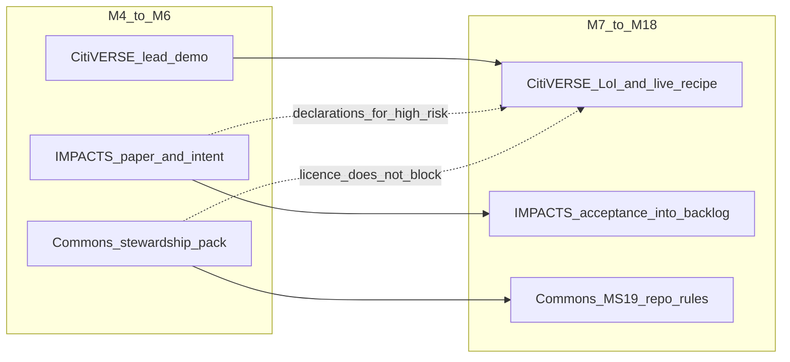

# Route 3 — WP4 canonical split, CitiVERSE-first

Operating model for the chosen EuropAI handover route. Hub:
[21-europai-edic-handover.md](../21-europai-edic-handover.md).

**Locked decision:** do **not** run route 1 (Toolbox-only) or route 2
(national App Store first). Open three EDIC relationships in parallel.
Land the **first working asset** in LDT CitiVERSE because the Toolbox
adapters already exist. IMPACTS and Digital Commons start in the same
month; they lag on *integration*, not on *contact*.

Today is project **M3** (September 2026). Framing window **M4–M6**
(October–December 2026) is the first operating quarter of this route.

## 1. What “CitiVERSE-first” means

| It means | It does not mean |
|----------|------------------|
| CitiVERSE is the first **operational landing** (live recipe + city demo) | IMPACTS and Commons wait until CitiVERSE is finished |
| The first framing meeting with a running demo is CitiVERSE | We only talk to one EDIC |
| Spatial recipes / agents / city module travel on this track | GovChat-NL or the framework are filed as city apps |
| Toolbox IM / UCS / Marketplace / P&V are **consumed** | We rebuild a marketplace to move faster |
| Fallback VNG/Geonovum is armed from M12 **per track** | National App Store is the primary path now |

Route 1 would publish recipes and stop — IMPACTS and Commons stay empty,
WP4 KPI “≥3 EDICs” fails. Route 2 would park Flow C (legitimacy and
maintenance money) until a national store exists. Route 3 keeps Flow C
running from M4 on three doors at once.

## 2. Three parallel tracks (lead / paper / stewardship)

| Track | EDIC | Cadence to M12 | First artefact they can point at |
|-------|------|----------------|----------------------------------|
| **Lead** | LDT CitiVERSE | Demo in M4–M6; LoI by M12 | `spatial-overlay-analysis` live on Toolbox |
| **Paper** | IMPACTS | Fit + framework spec now; LoI by M12 | Declarations + orchestrator contract |
| **Stewardship** | Digital Commons | Pack now; LoI by M12 | CONTRIBUTING / SECURITY / envelope |

Tracks **fail independently**. A red Commons gate does not pause the
CitiVERSE live path. A red CitiVERSE gate does not cancel IMPACTS
intent — switch that track to its fallback ([stage-gates.md](stage-gates.md)).

## 3. Interface contracts (what each EDIC must not claim)

These boundaries are how route 3 stays one product instead of three
competing catalogues.

| Object | Owner EDIC | Other EDICs may | Other EDICs must not |
|--------|------------|-----------------|----------------------|
| Spatial recipes, PoC agents, city onboarding | CitiVERSE | IMPACTS cites them as *evidence* of the framework | Commons must not productise them as a city app |
| Recipe schema, Critic V0–V4, marketplace *mechanism*, wallets | IMPACTS | CitiVERSE *uses* the mechanism to publish | CitiVERSE must not invent a second catalogue |
| Source (`nldt/`, `poc/`), GovChat-NL front door | Commons | CitiVERSE/IMPACTS *depend* on the repo | CitiVERSE must not take GovChat as Solution 2 |
| Toolbox IM / UCS / P&V / live EDC | L2 consume | All tracks | Nobody rebuilds them |

**Shared spine (all tracks):** doctrine *LLMs propose · engines dispose ·
humans decide*; asset map
[`../recipes/edic-asset-map.json`](../recipes/edic-asset-map.json);
identity = Toolbox IM.

Marketplace is the usual collision point. Rule: **CitiVERSE owns the
spatial offering; IMPACTS owns the publish contract** (ValidationReport +
PROV + `edic.destination` on the payload). One upload, two claims.

## 4. RACI for the next two quarters

| Action | A (accountable) | R (does the work) | C | I |
|--------|-----------------|-------------------|---|---|
| CitiVERSE framing + demo | VLO + LNDS | ICTU (this repo) | BZK | AAK |
| IMPACTS framing + framework spec | BZK + ICTU | ICTU | Geonovum | AAK |
| Commons framing + stewardship pack | BZK + ICTU | ICTU | GovChat-NL community (docs-only until MVP) | AAK |
| Live Toolbox path / IM token | ICTU | ICTU + Toolbox operator | LNDS | WP3 pilots |
| NLAIF route (LLM seams only) | LNDS | LNDS | ICTU | WP3 |
| Asset-map health | ICTU | ICTU | EDIC owners | WP4 lead |
| M12 continue-or-fallback | BZK (NL) | track owners | WP4 lead | consortium |

AAK stays forum lead (Cluster 1). It does **not** own EDIC Flow C
(WP4 Recommendation 1).

## 5. Ninety-day operating plan (M4–M6)

Three workstreams, one calendar. Do not wait for a joint EDIC workshop.

### Days 1–30 (October 2026) — open all three doors

1. Send the three one-pagers in the same week:
   [fit-citiverse.md](fit-citiverse.md),
   [fit-impacts.md](fit-impacts.md),
   [fit-commons.md](fit-commons.md).
2. Book **CitiVERSE first** (demo slot). Book IMPACTS and Commons as
   paper meetings in the same month — not as demos.
3. Confirm Toolbox IM client for `nldt-agent` (L2). Without it the lead
   track cannot leave mock.
4. Freeze the asset map: no new recipe without `edic` / `owner` /
   `acceptance` / `fallback`.

### Days 31–60 (November 2026) — lead track produces evidence

1. Run [citiverse-live-path.md](citiverse-live-path.md) until
   `python -m scripts.edic_live_readiness` is `hybrid` or `live` for
   UCS + Marketplace + P&V + IM (Data Platform optional for file://
   overlay).
2. Framing demo: `spatial-overlay-analysis` with ValidationReport + PROV
   on the marketplace payload. Offline fallback is allowed in the room;
   do not claim live if the script still says `mock`.
3. IMPACTS meeting: walk [impacts-framework.md](impacts-framework.md) and
   one high-risk declaration. Ask what their service portfolio is
   missing — write their answer into the map as *proposed* acceptance.
4. Commons meeting: walk CONTRIBUTING / SECURITY / envelope. Ask their
   licence and security-process bar. Log gaps; do not block CitiVERSE.

### Days 61–90 (December 2026) — leave M6 with named next dates

1. Each track has a named counterpart and a **next moment** (WP4 register
   rule). An entry without a next date is dormant.
2. CitiVERSE: written “we will consider this asset class” (pre-LoI).
3. IMPACTS + Commons: same, even if weaker. Silence is a data point, not
   a reason to switch yet (switch rule is M12).
4. Internal M6 note: live-path status, three next dates, open L2 debts
   (SIMPL, NLAIF confirmation, TEF slot).

## 6. Lead-track backlog (CitiVERSE, ordered)

Do these in order. Do not start Eindhoven/Utrecht high-risk as the first
live asset.

1. **`spatial-overlay-analysis`** — low risk, generic, already the
   reference recipe. Live Toolbox path.
2. **City module** — lifecycle skill +
   [skills/poc/nldt-poc-lifecycle/references/edic-city-onboarding.md](../skills/poc/nldt-poc-lifecycle/references/edic-city-onboarding.md).
3. **`breda-scan-qa` or `breda-five-value-scan`** — public sources, no
   secrets, cite-or-abstain. Candidate for CitCom.AI/sandbox (M9–M24).
   Schematic (English, Breda as the city illustration):
   [breda-route-map.md](breda-route-map.md).
4. **Utrecht scenario-sweep / Rijnland what-if / Eindhoven bp2op** — only
   after IMPACTS declarations are at least `proposed` (already on disk)
   and HITL is visible in the demo.

A2A Agent Card follows the reference recipe (Bearer via Toolbox IM).

## 7. Lag-track backlogs (do not let them steal the demo)

**IMPACTS (paper until M12, then backlog at M13):**

- Framework spec stays a *service description*, not a second runtime.
- Declarations stay against MIMs / Digital Rulebook
  ([declarations/](declarations/)).
- Requirements Flow A: [requirements-backlog.md](requirements-backlog.md)
  — quarterly, not a side slide deck.
- SIMPL debt stays on [l2-infrastructure.md](l2-infrastructure.md).
- First IMPACTS *integrated* asset after LoI: marketplace mechanism
  recognised, not a new spatial recipe.

**Commons (pack until MS19/MS21):**

- Keep GovChat-NL in this track ([14](../14-beleidskompas-integration.md)).
- No product launch under the nLDT name at EU level (WP4 §4.5).
- Maintenance envelope is the handover number
  ([maintenance-envelope.md](maintenance-envelope.md)).
- Licence exceptions (Open WebUI) stay documented; do not relicense
  GovChat as EUPL.

## 8. First three meeting agendas (45 minutes)

### CitiVERSE (demo)

1. Reciprocity (2 min): you get applied city AI; we get a catalogue slot.
2. Doctrine (3 min): LLMs never write zones.
3. Live or honest hybrid demo of `spatial-overlay-analysis` (15 min).
4. Asset class list — what is in, what is IMPACTS/Commons (5 min).
5. Proposed acceptance — ask them to rewrite it (10 min).
6. Next moment + named owner (5 min).

### IMPACTS (paper)

1. Reciprocity: you get a multi-country framework; we get procurement
   language and a home for Critic/HITL.
2. AppStore → Cookbook → Cook + V0–V4 (10 min).
3. One declaration + sovereignty tier (10 min).
4. Ask: what is missing from your service portfolio? (10 min).
5. Next moment.

### Commons (paper)

1. Reciprocity: you get a maintained common; we get a 2030 owner.
2. Repo tour: licence, CONTRIBUTING, SECURITY, envelope (15 min).
3. GovChat-NL as *this* asset class, not a city twin (5 min).
4. Ask their acceptance bar (10 min).
5. Next moment.

## 9. How we know route 3 is working (and not 1 or 2)

| Signal by M12 | Route 3 (pass) | Collapse into route 1 | Collapse into route 2 |
|---------------|----------------|-----------------------|------------------------|
| EDICs with a next date | 3 | 1 (Toolbox only) | 0; VNG/Geonovum only |
| Live spatial recipe on Toolbox | yes | yes | no / national viewer only |
| Framework treated as a service | IMPACTS LoI or written interest | ignored | parked as “App Store later” |
| Repo stewardship | Commons interest or OS2 fallback armed | none | national git only |
| WP4 SO3 path | still open | failed | delayed past Flow C |

At **M12** apply continue-or-fallback **per track**. It is valid to keep
CitiVERSE green and switch only Commons to OS2. That is still route 3.

## 10. Anti-patterns

- One “EDIC workshop” instead of three named owners.
- Publishing the same recipe as both a CitiVERSE city service and an
  IMPACTS building block with two marketplace ids.
- Waiting for SIMPL-Open or NLAIF before the overlay demo (engines are
  local; NLAIF is S7/S8 only).
- Filing beleidskompas as Solution 2.
- Building a visible EuropAI community that competes with the CSA.
- Treating VNG/App Store as the primary path before M12 (that is route 2).

## 11. Immediate next action

ICTU sends the CitiVERSE one-pager and asks for a demo slot in October
2026. Same week: IMPACTS and Commons one-pagers without a demo. Asset map
and this file are the dossier.
